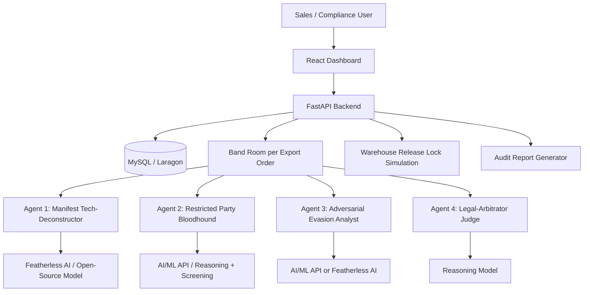
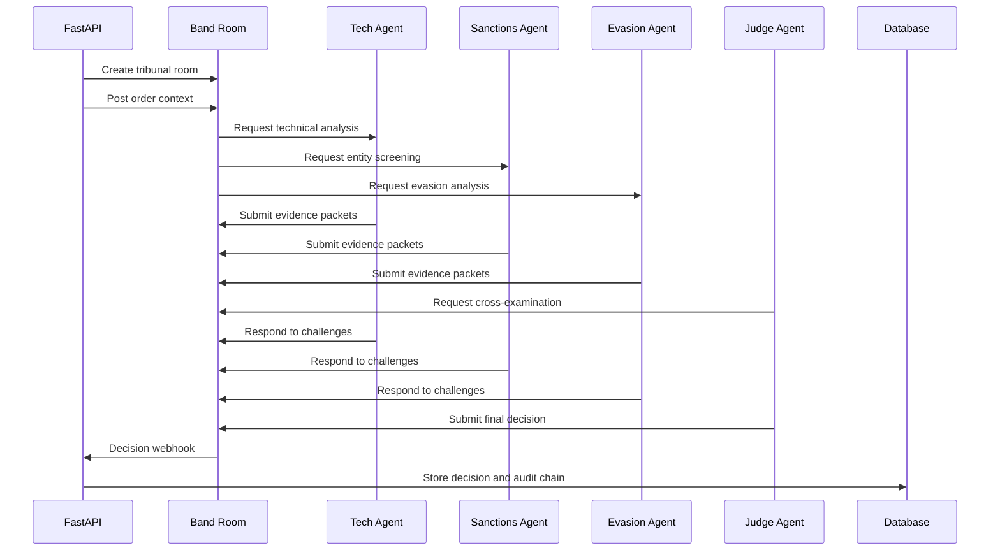

# AegisTrade AI — Revised Product Requirements Document (PRD)

**Product:** AegisTrade AI  
**Tagline:** Adversarial Multi-Agent Compliance Tribunal for Global Export
**Primary Goal:** Build a differentiated, defensible, demo-ready multi-agent enterprise workflow that uses Band as the core collaboration layer, not as a thin wrapper.

---

## 0. Executive Summary

AegisTrade AI is a Band-powered multi-agent export compliance tribunal for high-stakes global trade workflows. The product helps manufacturers, logistics teams, and compliance officers evaluate export orders before goods are released from warehouse control.

Unlike a single AI assistant that gives one-shot legal answers, AegisTrade AI creates a structured digital tribunal room where specialized agents exchange evidence, challenge each other, escalate ambiguity, and produce a defensible recommendation: **GO**, **HOLD**, or **NO-GO**.

The system is designed for situations where wrong decisions can create serious consequences: illegal exports, sanctions exposure, shipment delays, executive liability, reputational damage, and loss of export privileges.

AegisTrade AI does **not** replace licensed legal judgment. It performs rapid first-pass triage, organizes evidence, detects contradictions, identifies possible diversion risk, and creates a tamper-evident audit trail for human compliance officers.

The core innovation is the **Evidence Packet Protocol**: every agent claim must be submitted as a structured object with source, extracted fact, risk level, confidence score, and challenge status. This makes Band the live coordination layer for shared context, dispute resolution, role specialization, and decision handoff.

---

## 1. Product Positioning

### 1.1 Product Name

**AegisTrade AI**

### 1.2 Full Product Title

**AegisTrade AI — Adversarial Multi-Agent Compliance Tribunal for Global Export Risk**

### 1.3 Short Description

AegisTrade AI is a multi-agent export compliance gateway that uses Band rooms to let specialized AI agents investigate, challenge, and explain high-risk shipment decisions before goods are released.

### 1.4 One-Sentence Pitch

AegisTrade AI turns export compliance from a slow manual checklist into a structured multi-agent tribunal where technical, sanctions, evasion, and legal agents debate evidence before issuing a defensible shipment recommendation.

### 1.5 Hackathon Fit

AegisTrade AI is designed specifically for the **Regulated & High-Stakes Workflows** track. It demonstrates:

- At least 3 specialized agents collaborating through Band.
- Band as the core shared room for agent-to-agent communication.
- Structured context exchange, not just chat messages.
- Cross-agent review and challenge.
- Human-in-the-loop escalation.
- Enterprise value in compliance, logistics, and risk management.
- Clear originality beyond a simple chatbot or linear automation.

---

## 2. Problem Statement

### 2.1 Core Problem

Global manufacturers and logistics providers must screen export orders for technical export controls, sanctions risk, buyer risk, destination risk, and end-use risk. This process is often manual, slow, fragmented, and hard to audit.

A single shipment can involve:

- Product specifications.
- Export control classification candidates.
- Buyer identity.
- Ultimate beneficial ownership.
- End-user declarations.
- Intermediary logistics routes.
- Transit countries.
- Sanctions and restricted party screening.
- Internal approvals.
- Human override decisions.

When these checks happen across emails, spreadsheets, legal memos, and ERP notes, it becomes difficult to prove what the company knew, what it reviewed, and why it made a decision.

### 2.2 Current Pain Points

1. **Slow manual review**  
   Compliance review can take days because technical, legal, sales, and logistics teams must coordinate manually.

2. **Fragmented evidence**  
   Important facts are scattered across PDFs, ERP records, emails, and third-party screening systems.

3. **One-directional automation**  
   Many compliance tools only perform database lookup or rule matching. They do not actively debate ambiguity or challenge weak evidence.

4. **Weak auditability**  
   Even if the company performs due diligence, the rationale may not be stored in a regulator-ready format.

5. **Risk of misclassification**  
   Technical product descriptions may be vague or intentionally simplified, causing export classification risk.

6. **Risk of diversion**  
   A buyer may appear clean, but the transaction may still carry risk due to routing, ownership, vague end-use, or suspicious commercial patterns.

7. **Human overload**  
   Compliance officers need clear evidence summaries, not raw unstructured logs.

---

## 3. Product Vision

AegisTrade AI aims to become an **AI-assisted compliance decision infrastructure** for global trade teams.

The vision is not to let AI make final legal decisions. The vision is to make every high-risk trade decision:

- Faster to triage.
- Easier to explain.
- Harder to manipulate.
- Safer to escalate.
- More defensible during internal or regulatory review.

AegisTrade AI should feel like a digital compliance war room where every agent has a job, every claim requires evidence, every disagreement is tracked, and every decision leaves a trace.

---

## 4. Product Principles

### 4.1 Evidence Over Opinion

Agents are not allowed to simply say “this looks risky.” They must submit structured evidence packets.

### 4.2 Adversarial by Design

The system is intentionally built with agents that disagree. This prevents one model from dominating the decision.

### 4.3 Human Authority Preserved

The AI recommends. Humans approve, reject, or request additional documentation in ambiguous cases.

### 4.4 Fail-Safe, Not Fail-Open

When uncertainty remains, the system defaults to **HOLD**, not **GO**.

### 4.5 Traceability First

Every claim, challenge, decision, override, and document update must be logged.

### 4.6 Practical Hackathon Scope

The MVP simulates enterprise integrations where necessary. It should be impressive, explainable, and buildable within hackathon constraints.

---

## 5. Target Users

### 5.1 Primary Users

#### Compliance Officer

Responsible for reviewing export risk, approving or rejecting escalated shipments, and producing audit reports.

Needs:

- Clear risk summary.
- Agent evidence trail.
- Explainable decision matrix.
- Human override workflow.
- Exportable audit report.

#### Export Sales Manager

Responsible for entering order details and responding to documentation requests.

Needs:

- Fast status feedback.
- Clear reason for HOLD.
- List of missing documents.
- Simple upload flow.

#### Logistics Operator

Responsible for releasing or holding shipments.

Needs:

- Clear release status.
- Warehouse lock/release simulation.
- Shipment-level decision state.

### 5.2 Secondary Users

#### Executive / Legal Reviewer

Needs high-level risk visibility, defensible rationale, and escalation history.

#### Internal Auditor

Needs immutable or tamper-evident logs of decision-making and human overrides.

#### Product / Trade Classification Specialist

Needs technical extraction output and classification candidates.

---

## 6. Product Scope

### 6.1 In Scope for MVP

The hackathon MVP includes:

1. Export order ingestion.
2. PDF or structured manifest upload.
3. Buyer and route input.
4. Band room creation per order.
5. Four specialized agents collaborating through Band.
6. Evidence Packet Protocol.
7. Cross-examination loop.
8. GO / HOLD / NO-GO recommendation.
9. HOLD cure pack generation.
10. Human-in-the-loop review.
11. Dashboard decision matrix.
12. Warehouse release lock simulation.
13. Tamper-evident audit log.
14. Exportable markdown or PDF-ready compliance report.
15. Demo scenario with at least one high-risk shipment.

### 6.2 Out of Scope for MVP

The MVP does not include:

1. Full legal-grade ECCN determination.
2. Real legal advice.
3. Physical warehouse hardware integration.
4. Complete global sanctions database synchronization.
5. Real-time production ERP deployment.
6. Licensed attorney sign-off.
7. Full cryptographic notarization on a public blockchain.
8. Complete support for every export regulation worldwide.
9. Automatic filing of export licenses.
10. Autonomous final release of real-world shipments.

### 6.3 Post-MVP Scope

Future versions may include:

- Real ERP connectors.
- Live restricted-party screening APIs.
- Document authenticity checks.
- Continuous sanctions drift monitoring.
- Licensing workflow integration.
- Enterprise SSO.
- Advanced audit export.
- Policy versioning.
- Case reopening when regulations change.

---

## 7. Differentiation Strategy

Most hackathon projects risk becoming ordinary chatbot workflows. AegisTrade AI must win by showing **multi-agent collaboration that cannot be replaced by one prompt**.

### 7.1 Differentiator 1 — Evidence Packet Protocol

Every agent must output structured claims:

```json
{
  "packet_id": "EP-TECH-001",
  "agent": "Manifest Tech-Deconstructor",
  "claim": "The product may have dual-use export-control relevance.",
  "evidence_type": "technical_parameter",
  "source": "manifest_page_2",
  "extracted_fact": "Detection range: 5 km",
  "risk_level": "HIGH",
  "confidence": 0.82,
  "challenge_status": "OPEN",
  "requires_human_review": true
}
```

This makes the system more than a chat room. The Band room becomes a structured evidence exchange.

### 7.2 Differentiator 2 — Adversarial Evasion Analyst

The system includes a red-team style agent whose job is defensive: to detect possible evasion patterns, not to help evade rules.

It searches for:

- Vague product descriptions.
- Mismatch between technical specs and declared category.
- Suspicious transit route.
- Buyer with no shipment history.
- End-use description that is too generic.
- Ownership or control ambiguity.
- Repeated small orders that may represent order splitting.

### 7.3 Differentiator 3 — Cross-Examination Loop

Agents must challenge each other before the judge agent decides.

Example:

- Technical agent flags dual-use concern.
- Sanctions agent says buyer is not directly listed.
- Evasion agent flags route anomaly.
- Judge agent asks technical agent whether the evidence is classification-grade or only suspicion-grade.
- Judge agent asks sanctions agent whether indirect ownership creates escalation risk.
- Final decision includes accepted, disputed, and unresolved claims.

### 7.4 Differentiator 4 — Cure Pack Builder

When a case enters HOLD, AegisTrade AI generates a **Cure Pack**: a list of documents required to resolve ambiguity.

Possible cure documents:

- End-User Certificate.
- Ultimate Beneficial Ownership declaration.
- Non-reexport letter.
- Destination-use statement.
- Route justification.
- Product application declaration.
- Compliance officer attestation.
- Government or ministry end-use confirmation when applicable.

### 7.5 Differentiator 5 — Tamper-Evident Audit Trail

AegisTrade AI does not claim fully immutable storage in the MVP. Instead, it implements a tamper-evident audit chain.

Each event stores:

- Current event hash.
- Previous event hash.
- Timestamp.
- Actor or agent ID.
- Event payload.
- Decision state.

If an old log is modified, the hash chain breaks.

### 7.6 Differentiator 6 — Decision Defensibility Score

Instead of only showing risk, the system shows how defensible the decision is.

Example:

| Factor | Status |
|---|---|
| Technical evidence complete | Partial |
| Sanctions screening complete | Complete |
| Ownership verified | Incomplete |
| End-use verified | Missing |
| Route justified | Weak |
| Agent disagreement resolved | No |
| Final defensibility | Low |

A low defensibility score does not always mean illegal. It means the company cannot safely justify a GO decision yet.

---

## 8. Regulatory Context and Safety Boundaries

### 8.1 EAR Context

The Export Administration Regulations (EAR) govern the export of many commercial and dual-use items. Some items may have civilian use but also possible military or strategic use.

AegisTrade AI only proposes **classification candidates** and **risk indicators**. It does not claim final ECCN classification.

### 8.2 OFAC / Sanctions Context

Restricted-party screening is a critical part of global trade compliance. AegisTrade AI screens direct and indirect risk indicators but does not claim to be the final legal source of truth.

### 8.3 Ownership Rule Caution

The MVP must avoid saying that a minority ownership percentage automatically means a blocked party. For example, 45% ownership by a risky entity may create escalation risk, but it should not be described as automatically blocked unless the relevant legal standard is met.

Correct product language:

> “Not automatically blocked based on the available ownership threshold, but escalated to HOLD due to significant control, affiliation, or diversion concern.”

### 8.4 Legal Disclaimer

AegisTrade AI is a decision-support and auditability system. It does not provide legal advice and does not replace licensed export counsel, compliance officers, or authorized government determinations.

---

## 9. System Overview

### 9.1 High-Level Architecture



### 9.2 Core Components

| Component | Description |
|---|---|
| React Dashboard | User-facing interface for order ingestion, status, evidence graph, and human review. |
| FastAPI Backend | Core orchestration API, database service, Band room creation, and report generation. |
| Band SDK | Collaboration layer where agents exchange structured evidence and challenges. |
| Remote Agents | Specialized AI agents with distinct roles and models. |
| MySQL / Laragon | MVP database for orders, users, rooms, messages, evidence packets, and audit logs. |
| Warehouse Lock Simulator | Simulates shipment hold/release state. |
| Audit Report Generator | Produces compliance decision reports. |

---

## 10. Agent Design

### 10.1 Agent 1 — Manifest Tech-Deconstructor

**Role:** Technical product auditor  
**Primary Objective:** Extract technical parameters and identify possible export-control classification candidates.  
**Personality:** Skeptical, detail-oriented, technical.  
**Model Suggestion:** Llama-3 or similar open-source model through Featherless AI.

Responsibilities:

- Parse product manifest.
- Extract product category, model, technical parameters, and declared use.
- Identify suspicious mismatch between description and specifications.
- Propose ECCN candidate categories.
- Submit technical evidence packets.
- Respond to challenges from other agents.

Outputs:

- Technical risk score.
- Extracted parameters.
- ECCN candidate list.
- Ambiguity flags.
- Evidence packets.

Example:

```json
{
  "packet_id": "EP-TECH-004",
  "agent": "Manifest Tech-Deconstructor",
  "claim": "Declared product category appears underspecified relative to technical range.",
  "evidence_type": "manifest_mismatch",
  "source": "uploaded_manifest.pdf:p3",
  "extracted_fact": "Declared as industrial sensor, but range and sensitivity exceed typical low-risk catalog pattern.",
  "risk_level": "MEDIUM",
  "confidence": 0.76,
  "challenge_status": "OPEN"
}
```

---

### 10.2 Agent 2 — Restricted Party & Ownership Bloodhound

**Role:** Sanctions, restricted party, and ownership investigator  
**Primary Objective:** Screen buyer, consignee, end-user, intermediaries, aliases, and ownership risk.  
**Personality:** Suspicious, investigative, entity-focused.  
**Model Suggestion:** Mixtral or other reasoning model through AI/ML API.

Responsibilities:

- Check buyer name against mock or live restricted-party datasets.
- Compare aliases and similar entity names.
- Review beneficial ownership data if provided.
- Flag shell-company patterns.
- Flag control or affiliation risk.
- Submit entity risk evidence packets.

Outputs:

- Direct match result.
- Fuzzy match result.
- Ownership risk.
- Alias risk.
- Beneficial ownership confidence.
- Evidence packets.

Example:

```json
{
  "packet_id": "EP-ENTITY-002",
  "agent": "Restricted Party & Ownership Bloodhound",
  "claim": "No direct restricted-party match found, but ownership data is incomplete.",
  "evidence_type": "ownership_gap",
  "source": "buyer_profile.json",
  "extracted_fact": "Ultimate beneficial owner field is missing.",
  "risk_level": "MEDIUM",
  "confidence": 0.71,
  "challenge_status": "OPEN",
  "requires_human_review": true
}
```

---

### 10.3 Agent 3 — Adversarial Evasion Analyst

**Role:** Defensive red-team investigator  
**Primary Objective:** Detect possible evasion patterns, inconsistencies, and diversion risk.  
**Personality:** Adversarial, skeptical, pattern-focused.  
**Model Suggestion:** AI/ML API model or Featherless open-source model.

Important safety framing:

> This agent does not generate evasion strategies for users. It identifies defensive risk patterns so compliance teams can prevent misuse.

Responsibilities:

- Detect suspicious routing.
- Detect vague or inconsistent end-use.
- Compare declared product category with technical parameters.
- Detect buyer with insufficient commercial history.
- Detect possible straw-buyer patterns.
- Detect order splitting or repeated high-risk orders.
- Challenge weak GO recommendations.

Outputs:

- Evasion risk score.
- Route anomaly score.
- Documentation inconsistency list.
- Cross-examination questions.
- Evidence packets.

Example:

```json
{
  "packet_id": "EP-EVASION-003",
  "agent": "Adversarial Evasion Analyst",
  "claim": "Route and end-use description create unresolved diversion risk.",
  "evidence_type": "route_enduse_inconsistency",
  "source": "order_form",
  "extracted_fact": "Destination is a trading intermediary; end-use field says 'general industrial monitoring' without facility details.",
  "risk_level": "HIGH",
  "confidence": 0.79,
  "challenge_status": "OPEN",
  "requires_human_review": true
}
```

---

### 10.4 Agent 4 — Legal-Arbitrator Judge

**Role:** Decision orchestrator and final recommendation agent  
**Primary Objective:** Read the evidence packets, resolve disputes, and issue a GO/HOLD/NO-GO recommendation.  
**Personality:** Neutral, conservative, audit-focused.  
**Model Suggestion:** Strong reasoning model through AI/ML API.

Responsibilities:

- Monitor the Band room.
- Enforce evidence packet format.
- Ask clarification questions to agents.
- Classify claims as accepted, disputed, unresolved, or escalated.
- Generate decision matrix.
- Trigger HOLD cure pack when ambiguity remains.
- Send final status to backend.
- Generate audit narrative.

Outputs:

- Final recommendation.
- Decision matrix.
- Explanation.
- Cure pack.
- Human review requirement.
- Audit report summary.

Example:

```json
{
  "decision_id": "DEC-ORDER-2026-0007",
  "decision": "HOLD",
  "reason": "No direct restricted-party match, but technical ambiguity, incomplete ownership data, and route/end-use inconsistency remain unresolved.",
  "accepted_claims": ["EP-TECH-004", "EP-ENTITY-002", "EP-EVASION-003"],
  "disputed_claims": [],
  "required_cure_pack": [
    "End-User Certificate",
    "Ultimate Beneficial Ownership Declaration",
    "Non-Reexport Letter",
    "Route Justification"
  ],
  "human_review_required": true
}
```

---

## 11. Band Room Collaboration Model

### 11.1 Room Creation

For each new export order, the backend creates a dedicated Band room:

```text
Tribunal-Order-{ORDER_ID}
```

The room contains:

- Order metadata.
- Uploaded manifest summary.
- Buyer data.
- Destination and routing data.
- Initial risk policy.
- Agent participation rules.

### 11.2 Room Participants

Minimum required agents:

1. Manifest Tech-Deconstructor.
2. Restricted Party & Ownership Bloodhound.
3. Legal-Arbitrator Judge.

Preferred hackathon version:

1. Manifest Tech-Deconstructor.
2. Restricted Party & Ownership Bloodhound.
3. Adversarial Evasion Analyst.
4. Legal-Arbitrator Judge.

### 11.3 Collaboration Phases



### 11.4 Why Band Is Central

Band is not used as a notification channel. It is used as:

- Agent room creation layer.
- Shared context layer.
- Agent discovery and coordination layer.
- Evidence exchange layer.
- Cross-examination room.
- Decision handoff layer.
- Audit source layer.

---

## 12. Evidence Packet Protocol

### 12.1 Purpose

The Evidence Packet Protocol ensures that agents do not produce unstructured opinions. Every important claim must be machine-readable, auditable, and challengeable.

### 12.2 Packet Schema

```json
{
  "packet_id": "EP-STRING",
  "order_id": "ORDER-ID",
  "room_id": "BAND-ROOM-ID",
  "agent_id": "AGENT-ID",
  "agent_role": "TECH | ENTITY | EVASION | JUDGE",
  "claim": "Human-readable claim",
  "evidence_type": "technical_parameter | sanctions_match | ownership_gap | route_anomaly | document_gap | contradiction | judge_summary",
  "source": "document, API, form, or room message",
  "source_pointer": "page, field, URL reference, or message id",
  "extracted_fact": "Specific fact extracted from source",
  "risk_level": "LOW | MEDIUM | HIGH | CRITICAL",
  "confidence": 0.0,
  "challenge_status": "OPEN | ACCEPTED | DISPUTED | RESOLVED | ESCALATED",
  "challenged_by": [],
  "requires_human_review": false,
  "created_at": "ISO-8601 timestamp"
}
```

### 12.3 Packet Validation Rules

- Every packet must have a claim.
- Every claim must have a source.
- Every risk level must include confidence.
- High and critical risk packets require judge review.
- GO decision is invalid if high-risk packets remain unresolved.
- HOLD decision is valid when ambiguity remains.
- NO-GO decision requires high-confidence prohibited indicator or critical risk.

### 12.4 Challenge Schema

```json
{
  "challenge_id": "CH-STRING",
  "target_packet_id": "EP-STRING",
  "challenger_agent_id": "AGENT-ID",
  "challenge_type": "insufficient_source | overclaim | contradiction | missing_context | legal_threshold_unclear",
  "challenge_question": "What exactly is being challenged?",
  "required_response": "Clarification, evidence, correction, or downgrade",
  "status": "OPEN | ANSWERED | SUSTAINED | OVERRULED",
  "created_at": "ISO-8601 timestamp"
}
```

---

## 13. Decision Logic

### 13.1 Decision States

| State | Meaning |
|---|---|
| `PENDING_LOCK` | Order submitted and default locked pending review. |
| `IN_TRIBUNAL` | Band room is active and agents are analyzing. |
| `GO` | Shipment may be released based on available evidence and human/system rules. |
| `HOLD` | Shipment cannot be released until additional documentation or review is completed. |
| `NO_GO` | Shipment should not proceed due to high-confidence prohibited or unacceptable risk. |
| `OVERRIDDEN_GO` | Human officer approved after HOLD with documented rationale. |
| `OVERRIDDEN_NO_GO` | Human officer rejected after review. |

### 13.2 GO Criteria

GO may be recommended only when:

- No direct restricted-party match exists.
- Technical risk is low or sufficiently explained.
- End-use is specific and plausible.
- Route is consistent with buyer profile.
- Ownership data is complete enough.
- No unresolved high-risk evidence packets remain.
- Judge agent signs final recommendation.

### 13.3 HOLD Criteria

HOLD is recommended when:

- Technical classification is uncertain.
- End-use is vague.
- Ownership data is incomplete.
- Buyer is new or has weak commercial history.
- Transit route appears inconsistent.
- Agents disagree on risk interpretation.
- Evidence is insufficient for defensible GO.
- Additional documents are needed.

### 13.4 NO-GO Criteria

NO-GO is recommended when:

- Direct restricted-party match is confirmed.
- End-user is prohibited or clearly linked to prohibited use.
- Document forgery is detected.
- Buyer refuses required documentation.
- Risk remains critical after human review.
- A prohibited destination or end-use indicator is confirmed.

### 13.5 Deadlock Rule

If agents cannot resolve disagreement within the maximum debate rounds, the judge must issue **HOLD**.

Default rule:

```text
When uncertain, hold. Never release based on unresolved ambiguity.
```

### 13.6 Maximum Debate Rounds

To prevent infinite loops and token drain:

- Maximum initial analysis: 1 round per non-judge agent.
- Maximum cross-examination: 2 rounds.
- Maximum judge clarification: 1 round.
- Maximum total debate cycle: 3 rounds.
- If unresolved after round 3: automatic HOLD.

---

## 14. Human-in-the-Loop Workflow

### 14.1 HOLD Review

When the judge agent issues HOLD:

1. Order status becomes `HOLD`.
2. Warehouse release remains locked.
3. Cure Pack is generated.
4. Sales is notified of required documents.
5. Compliance officer receives review task.
6. Officer reviews evidence packets and agent transcript.
7. Officer can request more documents, approve, or reject.

### 14.2 Human Override Rules

Human override must include:

- Officer ID.
- Decision.
- Reason.
- Documents reviewed.
- Timestamp.
- Optional notes.
- New hash-chain event.

### 14.3 Override Types

| Override | Meaning |
|---|---|
| `OVERRIDDEN_GO` | Officer approves after additional evidence. |
| `OVERRIDDEN_NO_GO` | Officer rejects shipment after review. |
| `REQUEST_MORE_INFO` | Officer asks sales/buyer for more documentation. |

### 14.4 Cure Pack Example

For a high-risk thermal sensor order to an intermediary buyer:

```json
{
  "required_documents": [
    "End-User Certificate",
    "Ultimate Beneficial Ownership Declaration",
    "Non-Reexport Letter",
    "Specific End-Use Statement",
    "Transit Route Justification"
  ],
  "recommended_questions": [
    "Who is the final facility receiving the product?",
    "What is the exact industrial process requiring this sensor?",
    "Will the product be re-exported?",
    "Who owns or controls the buyer?"
  ]
}
```

---

## 15. User Stories

### 15.1 Sales Staff

As a Sales Staff member, I want to submit an export order and immediately see whether it is GO, HOLD, or NO-GO so that I know whether I can proceed with fulfillment.

Acceptance criteria:

- Sales can input buyer, destination, route, and product manifest.
- Sales can see current status.
- Sales can see required documents if status is HOLD.
- Sales cannot manually force GO.

### 15.2 Compliance Officer

As a Compliance Officer, I want to review the AI tribunal’s evidence and challenges so that I can make a defensible final decision.

Acceptance criteria:

- Officer can view evidence packets.
- Officer can view agent debate transcript.
- Officer can see accepted/disputed/unresolved claims.
- Officer can approve, reject, or request more information.
- Override requires written rationale.

### 15.3 Logistics Operator

As a Logistics Operator, I want a clear release/lock status so that I do not accidentally release a shipment under review.

Acceptance criteria:

- Logistics sees shipment status.
- Status is locked by default during review.
- Only GO or OVERRIDDEN_GO releases the simulated WMS lock.
- HOLD and NO-GO remain locked.

### 15.4 Executive Reviewer

As an Executive Reviewer, I want a high-level audit report so that I can understand risk posture and due diligence.

Acceptance criteria:

- Report shows order data.
- Report shows final decision.
- Report shows evidence summary.
- Report shows human override if any.
- Report shows hash integrity status.

---

## 16. Functional Requirements

### 16.1 Order Management

| ID | Requirement | Priority |
|---|---|---|
| FR-ORD-01 | User can create new export order. | Must |
| FR-ORD-02 | User can upload manifest or input structured product data. | Must |
| FR-ORD-03 | System assigns unique order ID. | Must |
| FR-ORD-04 | System sets new order to `PENDING_LOCK`. | Must |
| FR-ORD-05 | User can view order list and status. | Must |
| FR-ORD-06 | User can open order detail page. | Must |

### 16.2 Band Room Orchestration

| ID | Requirement | Priority |
|---|---|---|
| FR-BAND-01 | System creates a Band room per order. | Must |
| FR-BAND-02 | System posts order context into Band room. | Must |
| FR-BAND-03 | System invites or connects specialized agents. | Must |
| FR-BAND-04 | Agents submit structured evidence packets through Band. | Must |
| FR-BAND-05 | Judge agent reads room context before decision. | Must |
| FR-BAND-06 | Room transcript is stored in backend. | Should |

### 16.3 Agent Requirements

| ID | Requirement | Priority |
|---|---|---|
| FR-AGT-01 | Tech agent extracts technical parameters. | Must |
| FR-AGT-02 | Entity agent screens buyer and ownership risk. | Must |
| FR-AGT-03 | Evasion agent identifies defensive risk patterns. | Should / Strong Differentiator |
| FR-AGT-04 | Judge agent issues final recommendation. | Must |
| FR-AGT-05 | Agents must follow Evidence Packet Protocol. | Must |
| FR-AGT-06 | Agents can challenge evidence packets. | Should |
| FR-AGT-07 | Debate stops after maximum rounds. | Must |

### 16.4 Decision Engine

| ID | Requirement | Priority |
|---|---|---|
| FR-DEC-01 | System supports GO/HOLD/NO-GO. | Must |
| FR-DEC-02 | System blocks GO when high-risk unresolved packets exist. | Must |
| FR-DEC-03 | System defaults to HOLD on deadlock. | Must |
| FR-DEC-04 | System generates decision matrix. | Must |
| FR-DEC-05 | System calculates defensibility score. | Should |
| FR-DEC-06 | System generates cure pack for HOLD. | Must |

### 16.5 Human Review

| ID | Requirement | Priority |
|---|---|---|
| FR-HITL-01 | Compliance Officer can review HOLD cases. | Must |
| FR-HITL-02 | Officer can upload or mark received documents. | Should |
| FR-HITL-03 | Officer can approve, reject, or request more info. | Must |
| FR-HITL-04 | Override requires written rationale. | Must |
| FR-HITL-05 | Override is logged in audit chain. | Must |

### 16.6 Warehouse Lock Simulation

| ID | Requirement | Priority |
|---|---|---|
| FR-WMS-01 | Order starts locked. | Must |
| FR-WMS-02 | GO releases lock. | Must |
| FR-WMS-03 | HOLD and NO-GO keep lock active. | Must |
| FR-WMS-04 | Dashboard shows lock state. | Must |
| FR-WMS-05 | Webhook endpoint simulates warehouse integration. | Should |

### 16.7 Audit and Reporting

| ID | Requirement | Priority |
|---|---|---|
| FR-AUD-01 | System logs all evidence packets. | Must |
| FR-AUD-02 | System logs all agent challenges. | Should |
| FR-AUD-03 | System logs final decision. | Must |
| FR-AUD-04 | System logs human override. | Must |
| FR-AUD-05 | System generates exportable report. | Must |
| FR-AUD-06 | System verifies hash-chain integrity. | Should |

---

## 17. Non-Functional Requirements

### 17.1 Security

- API keys must be stored in environment variables.
- Agent tokens must not be exposed in frontend.
- Role-based access control should separate Sales, Compliance, and Logistics views.
- Sensitive manifest data should only be visible to authorized roles.

### 17.2 Reliability

- If an agent fails, the judge should mark the missing analysis as unresolved.
- If Band room creation fails, order remains `PENDING_LOCK`.
- If model API fails, status remains HOLD until rerun or manual review.

### 17.3 Performance

MVP target:

- Order creation: under 3 seconds.
- Band room creation: under 10 seconds.
- First-pass triage: under 60 seconds.
- Dashboard refresh: near real-time or polling every 3–5 seconds.

Important wording:

> The MVP targets fast first-pass triage, not final legal clearance in 30 seconds.

### 17.4 Explainability

Every final decision must include:

- Main risk drivers.
- Accepted claims.
- Disputed claims.
- Unresolved claims.
- Required documents.
- Human review status.

### 17.5 Auditability

Every important event must be recorded:

- Order submitted.
- Room created.
- Agent joined.
- Evidence submitted.
- Challenge submitted.
- Decision made.
- Human override made.
- Report exported.

---

## 18. Data Model

### 18.1 Core Tables

#### `users`

| Field | Type | Description |
|---|---|---|
| id | UUID | User ID |
| name | string | Full name |
| email | string | Login email |
| role | enum | SALES, COMPLIANCE, LOGISTICS, EXECUTIVE |
| created_at | datetime | Creation time |

#### `orders`

| Field | Type | Description |
|---|---|---|
| id | UUID | Order ID |
| buyer_name | string | Buyer company |
| destination_country | string | Final destination |
| transit_country | string | Transit route |
| product_name | string | Product name |
| declared_use | text | Declared end-use |
| status | enum | PENDING_LOCK, IN_TRIBUNAL, GO, HOLD, NO_GO |
| defensibility_score | float | Decision defensibility |
| created_by | UUID | Sales user |
| created_at | datetime | Creation time |
| updated_at | datetime | Update time |

#### `band_rooms`

| Field | Type | Description |
|---|---|---|
| id | UUID | Internal room record |
| order_id | UUID | Related order |
| band_room_id | string | Band room identifier |
| room_name | string | Tribunal room name |
| status | enum | CREATED, ACTIVE, CLOSED, FAILED |
| created_at | datetime | Creation time |

#### `evidence_packets`

| Field | Type | Description |
|---|---|---|
| id | UUID | Packet ID |
| order_id | UUID | Related order |
| room_id | UUID | Related room |
| agent_id | string | Agent ID |
| agent_role | enum | TECH, ENTITY, EVASION, JUDGE |
| claim | text | Claim |
| evidence_type | string | Evidence category |
| source | string | Evidence source |
| extracted_fact | text | Extracted fact |
| risk_level | enum | LOW, MEDIUM, HIGH, CRITICAL |
| confidence | float | 0.0 to 1.0 |
| challenge_status | enum | OPEN, ACCEPTED, DISPUTED, RESOLVED, ESCALATED |
| requires_human_review | boolean | Review flag |
| created_at | datetime | Timestamp |

#### `agent_challenges`

| Field | Type | Description |
|---|---|---|
| id | UUID | Challenge ID |
| target_packet_id | UUID | Evidence packet being challenged |
| challenger_agent_id | string | Agent making challenge |
| challenge_type | string | Type of challenge |
| challenge_question | text | Question |
| status | enum | OPEN, ANSWERED, SUSTAINED, OVERRULED |
| created_at | datetime | Timestamp |

#### `decisions`

| Field | Type | Description |
|---|---|---|
| id | UUID | Decision ID |
| order_id | UUID | Related order |
| decision | enum | GO, HOLD, NO_GO |
| rationale | text | Explanation |
| accepted_claims | json | Accepted evidence IDs |
| disputed_claims | json | Disputed evidence IDs |
| unresolved_claims | json | Unresolved evidence IDs |
| cure_pack | json | Required documents |
| judge_agent_id | string | Judge agent |
| created_at | datetime | Timestamp |

#### `warehouse_gates`

| Field | Type | Description |
|---|---|---|
| id | UUID | Gate record |
| order_id | UUID | Related order |
| lock_status | enum | LOCKED, RELEASED |
| last_signal | string | Last webhook/event |
| updated_at | datetime | Timestamp |

#### `override_logs`

| Field | Type | Description |
|---|---|---|
| id | UUID | Override ID |
| order_id | UUID | Related order |
| officer_id | UUID | Compliance officer |
| previous_status | enum | Previous decision |
| new_status | enum | Override decision |
| rationale | text | Human explanation |
| documents_reviewed | json | Document list |
| created_at | datetime | Timestamp |

#### `audit_chain`

| Field | Type | Description |
|---|---|---|
| id | UUID | Audit event ID |
| order_id | UUID | Related order |
| event_type | string | Event category |
| actor_type | enum | USER, AGENT, SYSTEM |
| actor_id | string | Actor ID |
| payload_json | json | Event data |
| previous_hash | string | Prior event hash |
| current_hash | string | Current hash |
| created_at | datetime | Timestamp |

---

## 19. API Design

### 19.1 Order APIs

```http
POST /api/v1/orders
```

Creates a new export order and starts tribunal flow.

Request:

```json
{
  "buyer_name": "Al-Mizan Logistics",
  "destination_country": "Oman",
  "transit_country": "UAE",
  "product_name": "Thermal Imaging Module",
  "declared_use": "General industrial monitoring",
  "manifest_file_id": "FILE-001"
}
```

Response:

```json
{
  "order_id": "ORDER-2026-0001",
  "status": "PENDING_LOCK",
  "message": "Order created and locked pending tribunal review."
}
```

```http
GET /api/v1/orders/{order_id}
```

Returns order detail, status, decision matrix, and warehouse lock state.

---

### 19.2 Band Orchestration APIs

```http
POST /api/v1/band/rooms/create
```

Creates tribunal room for an order.

```http
GET /api/v1/band/rooms/{room_id}/logs
```

Returns transcript and structured agent messages.

---

### 19.3 Evidence APIs

```http
POST /api/v1/evidence-packets
```

Stores evidence packet submitted by an agent.

```http
GET /api/v1/orders/{order_id}/evidence
```

Returns evidence packets for an order.

---

### 19.4 Decision APIs

```http
POST /api/v1/decisions
```

Stores judge decision.

```http
GET /api/v1/orders/{order_id}/decision
```

Returns final or current decision.

---

### 19.5 Human Review APIs

```http
POST /api/v1/orders/{order_id}/override
```

Human compliance override.

Request:

```json
{
  "new_status": "OVERRIDDEN_GO",
  "rationale": "End-User Certificate and UBO declaration reviewed. Route clarified. No unresolved high-risk packet remains.",
  "documents_reviewed": [
    "End-User Certificate",
    "UBO Declaration",
    "Non-Reexport Letter"
  ]
}
```

---

### 19.6 Warehouse Simulation APIs

```http
POST /api/v1/warehouse/webhook-lock
```

Updates simulated lock state.

```http
GET /api/v1/warehouse/orders/{order_id}/status
```

Returns lock state.

---

### 19.7 Report APIs

```http
GET /api/v1/orders/{order_id}/audit-report
```

Returns audit report data.

```http
GET /api/v1/orders/{order_id}/audit-report/export
```

Exports report as markdown or PDF-ready content.

---

## 20. Dashboard Requirements

### 20.1 Main Pages

1. Login page.
2. Order intake page.
3. Order list page.
4. Order detail page.
5. Tribunal live room mirror.
6. Evidence packet table.
7. Decision matrix.
8. Cure pack panel.
9. Warehouse lock panel.
10. Human review page.
11. Audit report page.

### 20.2 Dashboard Layout for Order Detail

Recommended sections:

1. Header:
   - Order ID.
   - Buyer.
   - Destination.
   - Current status.
   - Warehouse lock state.

2. Risk Summary:
   - Technical risk.
   - Entity risk.
   - Evasion risk.
   - Documentation risk.
   - Defensibility score.

3. Agent Activity:
   - Agent avatars.
   - Current phase.
   - Last message.
   - Evidence count.

4. Evidence Matrix:
   - Claim.
   - Agent.
   - Risk.
   - Confidence.
   - Status.
   - Challenge count.

5. Decision Panel:
   - GO/HOLD/NO-GO.
   - Rationale.
   - Required documents.

6. Audit Trail:
   - Timeline.
   - Hash verification.
   - Export report button.

### 20.3 Status Colors

| Status | Color Meaning |
|---|---|
| GO | Green / released |
| HOLD | Amber / pending review |
| NO-GO | Red / blocked |
| PENDING_LOCK | Blue-gray / waiting |
| IN_TRIBUNAL | Purple or blue / active analysis |

---

## 21. Demo Scenario

### 21.1 Scenario Title

**The Suspicious Thermal Sensor Export**

### 21.2 Input

Sales submits:

```json
{
  "buyer_name": "Al-Mizan Logistics FZE",
  "destination_country": "Oman",
  "transit_country": "UAE",
  "product_name": "Industrial Thermal Imaging Module",
  "quantity": 1000,
  "declared_use": "General industrial monitoring",
  "product_specs": {
    "detection_range": "5 km",
    "thermal_sensitivity": "high",
    "operating_temperature": "-40C to 85C",
    "mounting": "drone-compatible bracket"
  }
}
```

### 21.3 Expected Agent Behavior

#### Tech Agent

Flags technical ambiguity:

- Product declared as industrial sensor.
- Range and mounting spec may require further classification review.
- Submits medium/high technical risk evidence packet.

#### Entity Agent

Finds no direct restricted-party match:

- Buyer not directly listed in mock screening data.
- Ownership data incomplete or contains affiliation ambiguity.
- Submits ownership gap packet.

#### Evasion Agent

Flags route/end-use inconsistency:

- Buyer is a logistics intermediary.
- End-use is vague.
- Route involves transshipment.
- Quantity is large.
- Submits diversion risk packet.

#### Judge Agent

Final recommendation:

```text
HOLD
```

Rationale:

> No direct restricted-party match was found, but technical ambiguity, incomplete ownership information, and route/end-use inconsistency make a GO decision insufficiently defensible.

Cure Pack:

- End-User Certificate.
- UBO Declaration.
- Non-Reexport Letter.
- Route Justification.
- Specific End-Use Statement.

### 21.4 Demo Punchline

The product should show:

> “A single AI might say this buyer is clean. AegisTrade AI catches that the buyer being clean is not enough when the product, route, and end-use still create unresolved risk.”

This is the key winning story.

---

## 22. Demo Script for Video

### 22.1 60-Second Demo Narration

> Most AI compliance tools answer one question: “Is this buyer on a list?”  
> AegisTrade AI asks a better question: “Can this company defend the decision to release this shipment?”
>
> Here, a sales user submits an export order for thermal imaging modules. The order is locked by default and a Band tribunal room is created.
>
> Four agents join the room. The technical agent extracts product specs and flags possible dual-use ambiguity. The restricted-party agent screens the buyer and finds no direct sanctions match, but incomplete ownership data. The adversarial evasion analyst challenges the transaction because the route and end-use look too vague for a high-risk component.
>
> The judge agent reads the structured evidence packets, cross-examines unresolved claims, and issues HOLD, not because the order is proven illegal, but because a GO decision is not defensible yet.
>
> The system generates a Cure Pack, keeps the warehouse release locked, and gives the compliance officer a complete audit trail.
>
> AegisTrade AI is not a chatbot. It is a Band-powered compliance tribunal where agents prove, challenge, and defend high-stakes decisions.

---

## 23. Judging Criteria Alignment

### 23.1 Application of Technology

AegisTrade AI uses Band as the actual coordination layer:

- Agent-to-agent collaboration happens inside Band rooms.
- Agents exchange structured context.
- Agents challenge one another.
- Judge agent reads the full room state.
- Decision handoff returns to backend.
- Band transcript becomes part of the audit record.

### 23.2 Presentation

The demo is easy to understand:

1. Submit risky shipment.
2. Watch agents debate.
3. See evidence packets.
4. See decision matrix.
5. See HOLD and cure pack.
6. See human review.
7. Export audit report.

### 23.3 Business Value

AegisTrade AI addresses a real enterprise workflow:

- Reduces manual coordination.
- Speeds first-pass triage.
- Prevents accidental release.
- Creates evidence trail.
- Helps compliance teams prioritize risk.
- Improves defensibility of decisions.

### 23.4 Originality

The project goes beyond chatbot automation by using:

- Adversarial multi-agent design.
- Evidence Packet Protocol.
- Cross-examination.
- Cure Pack Builder.
- Decision Defensibility Score.
- Tamper-evident audit chain.
- Warehouse release lock simulation.

---

## 24. Success Metrics

### 24.1 MVP Success Metrics

| Metric | Target |
|---|---|
| Agents collaborating through Band | Minimum 3, target 4 |
| Evidence packets generated per case | 3–8 |
| Time to first recommendation | Under 60 seconds in demo |
| HOLD cure pack generated | Yes |
| Human override logged | Yes |
| Audit report generated | Yes |
| Warehouse lock simulation | Yes |
| Demo clarity | User understands in under 2 minutes |

### 24.2 Product Success Metrics

| Metric | Meaning |
|---|---|
| Review time reduction | Faster triage compared to manual review. |
| Evidence completeness | More decisions have documented rationale. |
| Escalation precision | HOLD cases are based on specific missing evidence. |
| False GO prevention | Risky ambiguous cases are held. |
| Audit readiness | Reports can be exported quickly. |

---

## 25. Risk Register

| Risk | Impact | Mitigation |
|---|---|---|
| Juri menganggap ini chatbot biasa | High | Show structured evidence packets and live Band room collaboration. |
| Legal claims terlalu berani | High | Use “recommendation”, “triage”, and “human review”, not “final legal decision”. |
| ECCN classification terlalu kompleks | High | Frame as candidate ranking and risk flagging. |
| OFAC ownership logic salah | High | Use cautious language and escalation, not automatic blocking unless threshold is met. |
| Demo terlalu luas | Medium | Focus on one strong scenario. |
| Band integration gagal saat demo | High | Prepare fallback recorded transcript and mock room mirror. |
| Agent loop menghabiskan token | Medium | Enforce max 3 debate rounds. |
| Dashboard kurang selesai | Medium | Prioritize order detail, evidence matrix, and decision panel. |
| Report export gagal | Low | Export markdown first; PDF optional. |

---

## 26. Implementation Plan

### 26.1 Build Priority

#### Priority 1 — Core Demo

- Create order form.
- Create order database.
- Create Band room per order.
- Connect at least 3 agents.
- Generate evidence packets.
- Judge emits GO/HOLD/NO-GO.
- Show status in dashboard.

#### Priority 2 — Differentiators

- Add Adversarial Evasion Analyst.
- Add challenge loop.
- Add Cure Pack Builder.
- Add decision defensibility score.
- Add audit report export.

#### Priority 3 — Polish

- Add hash-chain verification UI.
- Add warehouse lock simulation.
- Add role-based dashboard.
- Add polished demo data.
- Add submission-ready README screenshots.

### 26.2 Recommended Hackathon Build Order

1. Backend schema and mock order.
2. Band room creation.
3. Agent message format.
4. Evidence packet table.
5. Judge decision engine.
6. Dashboard order detail.
7. Cure pack display.
8. Audit report export.
9. Video demo script.
10. Final README polish.

---

## 27. Recommended Repository Structure

```text
aegistrade-ai/
├── backend/
│   ├── app/
│   │   ├── main.py
│   │   ├── config.py
│   │   ├── database.py
│   │   ├── models/
│   │   │   ├── order.py
│   │   │   ├── band_room.py
│   │   │   ├── evidence_packet.py
│   │   │   ├── decision.py
│   │   │   └── audit_chain.py
│   │   ├── routes/
│   │   │   ├── orders.py
│   │   │   ├── band.py
│   │   │   ├── evidence.py
│   │   │   ├── decisions.py
│   │   │   ├── warehouse.py
│   │   │   └── reports.py
│   │   ├── services/
│   │   │   ├── band_service.py
│   │   │   ├── evidence_service.py
│   │   │   ├── decision_service.py
│   │   │   ├── audit_service.py
│   │   │   └── report_service.py
│   │   └── agents/
│   │       ├── tech_deconstructor.py
│   │       ├── sanctions_bloodhound.py
│   │       ├── evasion_analyst.py
│   │       └── legal_arbitrator.py
│   └── requirements.txt
├── frontend/
│   ├── src/
│   │   ├── pages/
│   │   ├── components/
│   │   ├── api/
│   │   └── lib/
│   └── package.json
├── demo-data/
│   ├── thermal_sensor_order.json
│   ├── mock_manifest.md
│   └── mock_screening_results.json
├── docs/
│   ├── PRD.md
│   ├── DEMO_SCRIPT.md
│   └── ARCHITECTURE.md
└── README.md
```

---

## 28. Sample Agent Prompts

### 28.1 Tech Agent System Prompt

```text
You are the Manifest Tech-Deconstructor for AegisTrade AI.

Your job is to inspect product descriptions and technical manifest data for possible export-control relevance. You do not make final legal classifications. You extract technical facts, identify ambiguity, and submit Evidence Packets.

Rules:
1. Do not provide legal conclusions.
2. Do not invent facts not present in the order context.
3. Every claim must include source and confidence.
4. If information is missing, create a document_gap packet.
5. If the product may be dual-use, propose candidate risk only.
6. Output must follow the Evidence Packet Protocol JSON schema.
```

### 28.2 Entity Agent System Prompt

```text
You are the Restricted Party & Ownership Bloodhound for AegisTrade AI.

Your job is to screen buyer, consignee, end-user, aliases, ownership data, and route parties for restricted-party and ownership risk. You do not declare final legality. You identify direct matches, fuzzy matches, missing ownership data, and control concerns.

Rules:
1. Distinguish direct match from fuzzy match.
2. Do not claim automatic blocking unless evidence supports it.
3. Missing ownership data should create HOLD risk, not automatic NO-GO.
4. Every claim must be submitted as an Evidence Packet.
5. Output must follow the Evidence Packet Protocol JSON schema.
```

### 28.3 Evasion Agent System Prompt

```text
You are the Adversarial Evasion Analyst for AegisTrade AI.

Your job is defensive. You identify possible evasion, diversion, misclassification, or documentation inconsistency patterns so the company can prevent illegal or unsafe shipment release.

You must not provide instructions for evading sanctions or export controls. You only flag risk indicators and request clarifying evidence.

Rules:
1. Look for vague descriptions, route anomalies, missing end-use, buyer inconsistency, and document gaps.
2. Do not invent malicious intent.
3. Escalate ambiguity as HOLD risk.
4. Every claim must be submitted as an Evidence Packet.
5. Output must follow the Evidence Packet Protocol JSON schema.
```

### 28.4 Judge Agent System Prompt

```text
You are the Legal-Arbitrator Judge for AegisTrade AI.

Your job is to read evidence packets and challenges from the Band tribunal room, resolve claim status, and issue a GO, HOLD, or NO-GO recommendation.

You do not provide final legal advice. You produce a defensible compliance recommendation.

Decision rules:
1. GO is only allowed when no high-risk unresolved packet remains.
2. HOLD is required when ambiguity, missing documentation, ownership gaps, or unresolved challenges remain.
3. NO-GO requires high-confidence prohibited indicator or confirmed unacceptable risk.
4. If agents deadlock after maximum debate rounds, issue HOLD.
5. Always generate a rationale and cure pack for HOLD.
```

---

## 29. Sample Final Audit Report

```markdown
# AegisTrade AI Compliance Tribunal Report

## Order
- Order ID: ORDER-2026-0001
- Buyer: Al-Mizan Logistics FZE
- Destination: Oman
- Product: Industrial Thermal Imaging Module
- Status: HOLD

## Final Recommendation
The tribunal recommends HOLD.

## Rationale
No direct restricted-party match was found. However, the tribunal identified unresolved technical classification ambiguity, incomplete beneficial ownership data, and route/end-use inconsistency. A GO decision is not defensible until additional documentation is reviewed.

## Accepted Evidence
1. EP-TECH-004 — Product description is underspecified relative to technical range.
2. EP-ENTITY-002 — Ownership data is incomplete.
3. EP-EVASION-003 — Route and end-use description create unresolved diversion risk.

## Disputed Evidence
None.

## Unresolved Evidence
1. Final end-user identity.
2. Ultimate beneficial ownership.
3. Specific end-use and facility location.
4. Re-export restriction acceptance.

## Required Cure Pack
1. End-User Certificate.
2. Ultimate Beneficial Ownership Declaration.
3. Non-Reexport Letter.
4. Route Justification.
5. Specific End-Use Statement.

## Warehouse Status
LOCKED.

## Human Review Required
Yes.

## Audit Chain
Integrity status: Valid.
```

---

## 30. README Positioning Copy

Use this section in the public GitHub README.

```markdown
# AegisTrade AI

AegisTrade AI is an adversarial multi-agent compliance tribunal for global export risk. It uses Band as the live coordination layer where specialized agents exchange structured evidence, challenge each other, and produce defensible GO/HOLD/NO-GO recommendations for high-stakes export orders.

## Why It Matters

Most compliance automation tools screen a list or summarize a policy. AegisTrade AI does something different: it forces agents to prove, challenge, and defend their conclusions before a shipment can be released.

## Core Innovation

The Evidence Packet Protocol turns agent messages into structured, auditable claims. Every agent must provide source, extracted fact, risk level, confidence, and challenge status.

## Agents

- Manifest Tech-Deconstructor
- Restricted Party & Ownership Bloodhound
- Adversarial Evasion Analyst
- Legal-Arbitrator Judge

## Demo Flow

1. Sales submits a thermal sensor export order.
2. A Band tribunal room is created.
3. Agents analyze technical, entity, route, and evasion risk.
4. Judge agent issues HOLD.
5. System generates Cure Pack.
6. Warehouse release remains locked.
7. Compliance officer reviews and exports audit report.
```

---

## 31. Final Product Claim

The safest and strongest claim for the project:

> AegisTrade AI helps enterprises make high-stakes export decisions more defensible by turning compliance review into a structured multi-agent investigation with evidence, challenge, escalation, and auditability.

Avoid this claim:

> AegisTrade AI guarantees legal compliance.

Use this instead:

> AegisTrade AI improves the speed, traceability, and defensibility of export compliance review while preserving human authority for final decisions.

---

## 32. Submission Checklist

Before submitting to the hackathon, ensure the repository includes:

- [ ] Public GitHub repository.
- [ ] Clear README with product pitch.
- [ ] Demo video.
- [ ] Slide deck.
- [ ] Application URL or demo instructions.
- [ ] Screenshots.
- [ ] Architecture diagram.
- [ ] Agent role explanation.
- [ ] Evidence Packet Protocol explanation.
- [ ] Band usage explanation.
- [ ] Business value explanation.
- [ ] Limitations and legal disclaimer.
- [ ] Sample demo data.
- [ ] Setup instructions.
- [ ] Environment variable template.
- [ ] License.

---

## 33. Final Recommendation

AegisTrade AI should compete as:

```text
AegisTrade AI — Adversarial Compliance Tribunal for Global Export Risk
```

The project should not be presented as a generic compliance chatbot or simple sanctions screening tool. It should be presented as a Band-native, multi-agent, evidence-driven decision workflow for high-stakes enterprise trade compliance.

The winning angle is:

```text
Most agents answer.
AegisTrade AI makes agents prove, challenge, and defend.
```
