```markdown
# PRODUCT REQUIREMENT DOCUMENT

## AegisTrade AI: Multi-Agent Global Trade Compliance & EAR Enforcement Tribunal

### Secure Multi-Agent Autonomous Trade Audit & Geopolitical Risk Mitigation System

---

## Document Control

| Item            | Keterangan                                                                         |
| --------------- | ---------------------------------------------------------------------------------- |
| Nama Produk     | AegisTrade AI                                                                      |
| Platform        | Web Application Dashboard & Multi-Agent Network                                    |
| Frontend        | React Vite, Tailwind CSS, Shadcn/UI, Context API                                  |
| Backend         | Python FastAPI, Band SDK (`band.ai`), Codeband Framework                           |
| Database        | MySQL (Laragon Environment)                                                        |
| Mode Operasi    | Hybrid Cloud / On-Premise Enterprise Gateway                                       |
| Prinsip Desain  | Secure-by-Design, EAR/OFAC Compliance Architecture, Traceable Multi-Agent Debates  |
| Target Pengguna | Compliance Officer, Export Sales Managers, Logistics Teams, Executive Board        |

---

# 1. Ringkasan Produk

## 1.1 Nama Produk

**AegisTrade AI — Multi-Agent Global Trade Compliance & EAR Enforcement Tribunal**

AegisTrade AI adalah sistem otomasi kepatuhan hukum perdagangan internasional (*global trade compliance*) berbasis AI Multi-Agent yang dirancang untuk menyaring, membedah, dan mengaudit manifes ekspor secara otonom terhadap regulasi ketat **EAR (Export Administration Regulations)** dan sanksi ekonomi **OFAC (Office of Foreign Assets Control)**. 

Sistem ini beroperasi dengan mengintegrasikan sistem ERP internal perusahaan dengan platform kolaborasi **Band SDK (`band.ai`)**. Ketika pesanan ekspor baru diajukan, sistem secara otomatis memicu ruang sidang digital (*Tribunal Room*) terisolasi yang diisi oleh minimal 3 Agen AI dengan peran spesifik yang saling bertolak belakang. Agen-agen ini berdebat menggunakan inferensi model khusus (*specialized open-source models*) dari **Featherless AI** dan **AI/ML API** untuk menghasilkan keputusan akhir yang mutlak (GO, HOLD, atau NO-GO), mencegah pelanggaran hukum perdagangan sebelum kontainer logistik meninggalkan gudang fisik.

---

## 1.2 Latar Belakang

Dalam ekosistem perdagangan global, perusahaan manufaktur teknologi tingkat tinggi menghadapi ancaman hukum luar biasa. Komponen komersial umum seperti sensor thermal, mikrokontroler, dan osiloskop sering kali diklasifikasikan sebagai **Dual-Use Technology**—barang sipil yang dapat dimodifikasi menjadi pemandu rudal atau persenjataan militer. Pelanggaran terhadap aturan EAR dan transaksi dengan entitas yang disanksi oleh OFAC dapat menjatuhkan hukuman penjara hingga 20 tahun bagi jajaran eksekutif, denda puluhan juta dolar, serta pemutusan total dari jaringan perbankan internasional (SWIFT).

Metode audit kepatuhan manual saat ini memakan waktu 3-7 hari kerja dan rentan terhadap manipulasi dokumen atau kesalahan manusia (*human error*). Di sisi lain, penggunaan AI tunggal generik sering kali menghasilkan halusinasi hukum dan tidak memiliki akuntabilitas. AegisTrade AI memecahkan dilema ini dengan memanfaatkan ekosistem *Multi-Agent* otonom yang saling mengoreksi secara transparan dan mencatat seluruh alur berpikirnya ke dalam lembar audit (*audit trail*) yang tidak dapat dimanipulasi.

---

## 1.3 Tujuan Utama

Tujuan utama AegisTrade AI adalah:

1. Mempercepat proses audit kepatuhan ekspor dari hitungan hari menjadi di bawah 30 detik.
2. Mengidentifikasi barang berkategori *Dual-Use Technology* berdasarkan parameter teknis mentah secara akurat.
3. Mendeteksi skema pengalihan rute (*transshipment*) dan jaringan perusahaan cangkang (*shell companies*) di negara transit.
4. Menghilangkan ketergantungan pada penilaian satu arah AI dengan menerapkan mekanisme perdebatan multi-agen.
5. Menyediakan log audit forensik berbasis room-hash Band.ai yang siap diuji oleh regulator eksternal.
6. Mengintegrasikan keputusan hukum AI langsung dengan sistem penguncian fisik logistik gudang (*automated warehouse locking*).
7. Meminimalkan risiko sanksi sekunder (*secondary sanctions*) yang dapat membekukan keuangan korporasi.
8. Menyediakan mekanisme *Human-in-the-Loop* (HITL) yang aman untuk peninjauan tingkat lanjut.

---

# 2. Masalah yang Ingin Diselesaikan

## 2.1 Masalah Operasional

1. Pemeriksaan dokumen manifes ekspor yang tebal dan rumit sangat lambat dan memakan biaya operasional tinggi.
2. Tim penjualan (*Sales*) sering menyembunyikan detail parameter teknis barang demi mengejar target transaksi.
3. Penentuan kode klasifikasi ekspor (ECCN) sering keliru akibat dokumen teknis pabrik yang sangat kompleks.
4. Sulit memantau perubahan daftar entitas sanksi global (SDN List) yang diperbarui secara acak oleh otoritas internasional.
5. Koordinasi antara tim Sales di lapangan, tim Legal di kantor pusat, dan tim Logistik di gudang sangat terfragmentasi.
6. Pengambilan keputusan ekspor darurat atau bernilai tinggi sering dilakukan tanpa dasar analisis risiko hukum yang matang.

## 2.2 Masalah Keamanan & Hukum

1. Risiko tinggi lolosnya barang ke tangan militer asing akibat taktik penyamaran deskripsi barang (*misclassification*).
2. Taktik pembeli palsu (*straw buyer*) yang memanfaatkan negara ketiga yang netral sebagai titik transit penyelundupan.
3. Ketiadaan rekam jejak (*audit trail*) yang sah dan tersusun rapi jika suatu saat perusahaan dituduh melanggar EAR oleh pemerintah.
4. AI biasa sering mengalami halusinasi hukum, mensitasi regulasi yang tidak eksis, atau mengabaikan pembaruan aturan terbaru.
5. Risiko bypass internal di mana staf logistik tetap merilis barang dari gudang meskipun status legalitasnya masih dipertanyakan.
6. Kebocoran cetak biru (*blueprint*) teknologi sensitif ke pihak asing melalui transfer pengetahuan digital (*deemed export*).

---

# 3. Visi Produk

AegisTrade AI menjadi platform manajemen kepatuhan ekspor yang:

1. **Autonomous Compliance Tribunal**
   Menyelesaikan penilaian risiko hukum melalui mekanisme sidang dan debat otonom antar agen AI terspesialisasi.

2. **Strict Regulation Enforcer**
   Menjamin kepatuhan penuh terhadap standar EAR, OFAC, dan sanksi internasional tanpa kompromi komersial.

3. **Immutable Audit Integrity**
   Setiap pertukaran argumen agen di dalam platform Band tercatat secara permanen sebagai bukti ikhtiar kepatuhan perusahaan (*due diligence*).

4. **Logistically Connected**
   Keputusan hukum digital terhubung langsung dengan aksi pengamanan fisik barang di level infrastruktur rantai pasok.

5. **Cross-Framework Collaborative**
   Menggunakan keunggulan Band SDK untuk menjembatani agen-agen AI yang dibangun di atas framework dan model LLM yang berbeda secara seamless.

---

# 4. Ruang Lingkup Sistem

## 4.1 Termasuk dalam Sistem

AegisTrade AI mencakup:

1. Autentikasi pengguna multi-role terintegrasi sistem korporat.
2. Manajemen pendaftaran Remote Agent melalui dashboard Band (`Connect Remote Agent`).
3. Dashboard visual kepatuhan real-time untuk masing-masing role.
4. Ingestion otomatis data pesanan ekspor baru dari sistem ERP eksternal.
5. Ekstraksi teks otomatis dari file PDF manifes teknis komponen.
6. Otomatisasi pemicuan (*triggering*) pembuatan Room Tribunal baru di Band SDK.
7. Modul debat otonom otonom minimal 3 agen (Deconstructor, Bloodhound, Arbitrator).
8. Mesin pencari kecocokan ECCN (*Export Control Classification Number*) berbasis parameter teknis.
9. Pelacakan entitas pembeli terhadap database sanksi SDN OFAC via API.
10. Deteksi pola kepemilikan korporasi cangkang (*shell company pattern detection*).
11. Mekanisme pengambilan keputusan akhir terstruktur (GO, HOLD, NO-GO).
12. Integrasi webhook ke sistem kontrol gerbang/kunci fisik logistik gudang.
13. Alur peninjauan manual dokumen tambahan (*End-User Certificate*) oleh Compliance Officer.
14. Sistem log audit berantai berbasis hash room komunikasi Band.ai.
15. Manajemen pembatasan akses data teknis sensitif berdasarkan asas *Need-to-Know*.
16. Ekspor berkas laporan kepatuhan terenkripsi untuk kebutuhan inspeksi regulator pemerintah.

---

## 4.2 Tidak Termasuk dalam Sistem

AegisTrade AI tidak mencakup:

1. Sistem pembayaran bea cukai atau kalkulasi tarif pajak ekspor.
2. Pembuatan dokumen pengapalan fisik (*Bill of Lading*) komersial.
3. Pelacakan posisi kontainer logistik secara real-time via GPS di laut bebas.
4. Pengurusan izin lisensi ekspor resmi langsung ke sistem web BIS/pemerintah AS.
5. Manajemen penggajian (*payroll*) staf sales atau logistik perusahaan.
6. Otomasi penolakan sepihak tanpa pencatatan alasan log audit.
7. Analisis struktur kimia material mentah menggunakan lab fisik.
8. Pengaturan rute transportasi kapal kargo (*freight forwarding optimization*).
9. Enkripsi database ERP utama milik klien secara keseluruhan.

---

# 5. Stakeholder

| Stakeholder        | Kepentingan                                                       |
| ------------------ | ----------------------------------------------------------------- |
| Compliance Officer | Memastikan operasional ekspor 100% aman dari jerat sanksi EAR/OFAC |
| Export Sales Team  | Memasukkan data transaksi cepat dan mengetahui status kelayakan order |
| Gudang & Logistik  | Menerima instruksi rilis barang yang valid dan aman dari hukum    |
| Direksi / Board    | Memitigasi risiko penutupan perusahaan dan tuntutan pidana pribadi|
| Sistem Band.ai     | Menyediakan infrastruktur room komunikasi dan interaksi antar agen|
| Juri Hackathon     | Menilai inovasi arsitektur multi-agent, fungsionalitas Band SDK, dan nilai bisnis nyata |

---

# 6. Role Pengguna & Agen

## 6.1 Role Pengguna (Manusia)

### 1. Compliance Officer (Admin)
Mempunyai hak akses penuh untuk mengelola konfigurasi sistem, menguji log room Band, memberikan override status HOLD jika dokumen *End-User Certificate* telah valid, dan mengekstrak laporan audit resmi.

### 2. Export Sales Staff
Bertugas menginput order ekspor baru, mengunggah manifes teknis, memantau status persetujuan, dan melampirkan berkas sanggahan/lisensi jika pesanan terkena penangguhan.

### 3. Logistics Staff
Bertugas di area gudang fisik, memantau antrean rilis barang yang berstatus GO, dan menerima notifikasi peringatan jika ada sistem penguncian otomatis yang aktif akibat status HOLD/NO-GO.

## 6.2 Role Agen AI (Terintegrasi Band SDK)

### 1. Manifest Tech-Deconstructor (`@hilmimubarok2006/agent-deconstructor`)
Bertugas membedah data teknis barang, melakukan ekstraksi parameter dari PDF manufaktur, dan mendeteksi apakah barang memenuhi kriteria *Dual-Use Technology* berdasarkan threshold teknis internasional.

### 2. Geopolitical Sanctions Bloodhound
Bertugas menganalisis profil pembeli, menyisir database SDN OFAC, mendeteksi risiko negara transit, dan mencari indikasi struktur *shell company* dari entitas pemesan.

### 3. Logistics Legal-Arbitrator (The Judge)
Bertugas memimpin ruang komunikasi di Band, menimbang argumen dari Deconstructor dan Bloodhound, menghitung matriks risiko gabungan, menetapkan status akhir (GO/HOLD/NO-GO), serta menembakkan webhook ke sistem logistik gudang.

---

# 7. Matriks Hak Akses

| Fitur                     | Compliance Officer | Sales Staff | Logistik Staff | Agent Arbitrator |
| ------------------------- | -----------------: | ----------: | -------------: | ---------------: |
| Login & Session           |                 Ya |          Ya |             Ya |            Tidak |
| Registrasi Remote Agent   |                 Ya |       Tidak |          Tidak |            Tidak |
| Input Ekspor Manifes      |              Tidak |          Ya |          Tidak |            Tidak |
| Trigger Room Band.ai      |           Otomatis |    Otomatis |          Tidak |            Tidak |
| Interaksi Debat di Band   |           Terbatas |       Tidak |          Tidak |               Ya |
| Override Status HOLD      |                 Ya |       Tidak |          Standard |            Tidak |
| Monitoring Kunci Gudang   |                 Ya |       Tidak |             Ya |            Tidak |
| Tembak Webhook Logistik   |              Tidak |       Tidak |          Tidak |               Ya |
| Ekstrak Laporan Audit     |                 Ya |       Tidak |          Tidak |            Tidak |
| Edit Master Sanksi/ECCN   |                 Ya |       Tidak |          Tidak |            Tidak |

---

# 8. Arsitektur Sistem

## 8.1 Model Arsitektur

AegisTrade AI menggunakan arsitektur **Hybrid Multi-Agent Connected Hub** melalui Band SDK dengan backend utama berbasis FastAPI dan database MySQL pada lingkungan Laragon.

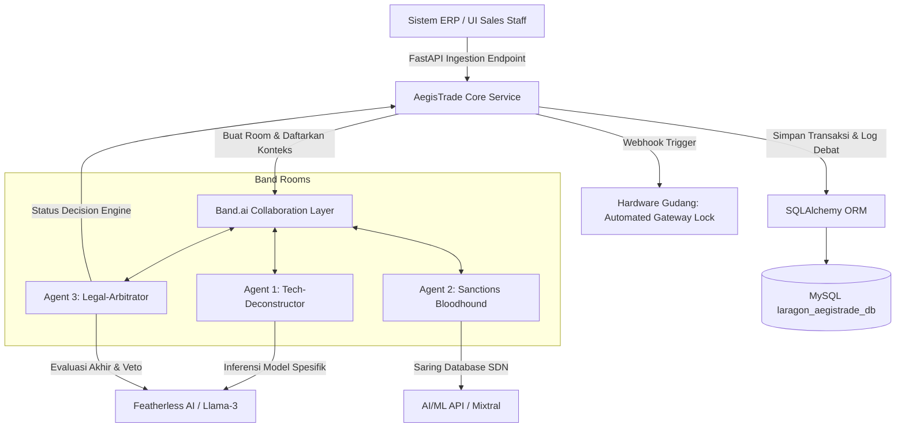

## 8.2 Komponen Utama

| Komponen | Fungsi |
| --- | --- |
| React Vite Dashboard | Antarmuka manajemen kepatuhan, input sales, dan rilis logistik |
| Tailwind CSS & Shadcn | Framework desain antarmuka responsif tingkat korporat |
| Python FastAPI | Backend inti penanganan sirkulasi data, webhook, dan manajemen state |
| Band SDK / API | Lapisan orkestrasi, tempat agen AI saling bertukar konteks terstruktur |
| Codeband Tooling | Referensi workflow otomasi penulisan skrip evaluasi aturan kepatuhan |
| Featherless AI | Penyedia serverless inference untuk open-source model tingkat tinggi |
| AI/ML API | Failback network penanganan pemrosesan ekstraksi dokumen regulasi |
| SQLAlchemy ORM | Pemetaan objek database relasional ke backend Python |
| MySQL (Laragon) | Penyimpanan data transaksional, log debat, master sanksi, dan data ECCN |

---

# 9. Prinsip Keamanan

## 9.1 Data Minimization & Leakage Prevention

Sistem menerapkan pembatasan ketat terhadap sirkulasi spesifikasi desain militer mentah. Dokumen dibedah di memori lokal, hanya parameter numerik penting dan kode ECCN yang dikirim ke jaringan luar untuk menghindari ancaman pelanggaran *Deemed Export*.

## 9.2 Tokenized Agent Authentication

Setiap Remote Agent yang terhubung melalui platform Band wajib menggunakan enkripsi API key unik. Sesuai dengan modul `Connect Remote Agent`, akses registri personal diamankan ketat untuk mencegah injeksi agen asing tidak sah ke dalam tribunal room perusahaan.

## 9.3 Multi-Model Redundancy Guardrails

Untuk menghindari fenomena halusinasi satu model LLM tunggal, sistem mewajibkan Agent 1 dan Agent 2 menggunakan basis model dari provider yang berbeda (misalnya Llama-3 melalui Featherless AI dan Mixtral via AI/ML API). Keputusan hukum tidak valid jika tidak tercapai kuorum argumen terstruktur.

## 9.4 Automated Warehouse Isolation (Air-Gapping Engine)

Status transaksi bersifat *Default-Lockout*. Sebelum keputusan bertanda **GO** diterbitkan secara sah dan tervalidasi oleh tanda tangan kriptografi Agent 3, API gudang akan mengunci status pengapalan barang di sistem fisik logistik.

## 9.5 Immutable Band Room Hash Chain

Semua pesan, interaksi, dan sanggahan antar agen dalam room Band.ai diproses menjadi satu rangkaian string hash berantai:

$$ExportOrderHash = SHA256(OrderID + MessageChainContent + PreviousRoomHash)$$

Jika ada entitas internal yang mencoba mengubah baris database log debat di Laragon MySQL, sistem akan mendeteksi ketidakcocokan dengan data state asli pada platform Band.ai.

---

# 10. Authentication & Session Design

## 10.1 Login Flow & Agent Security

1. Pengguna internal memasukkan kredensial korporat (Username/Password).
2. Backend FastAPI memvalidasi password menggunakan skema hashing `passlib[bcrypt]`.
3. Sesi JWT token berdurasi pendek diterbitkan untuk browser pengguna.
4. Di sisi lain, Remote Agent (`@hilmimubarok2006/agent`) terautentikasi ke dashboard Band menggunakan token API key dari lablab.ai untuk membuka jembatan komunikasi ganda (*Two-Way Communication Hub*).

## 10.2 Session Timeout & Lockout Policy

* Sesi UI browser otomatis hangus jika tidak ada aktivitas selama 30 menit.
* Jika terjadi percobaan akses endpoint ekspor ilegal dari IP tidak dikenal, sistem secara otomatis menonaktifkan API Key Sales terkait dan mengirimkan alarm darurat ke dashboard Compliance Officer.

---

# 11. User Flow Umum

## 11.1 Flow Pendaftaran Remote Agent & Inisiasi Sistem

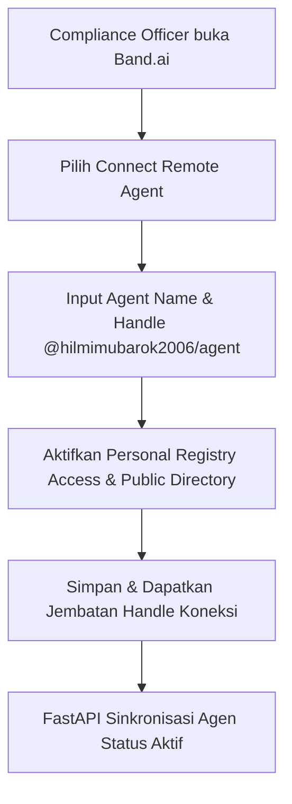

## 11.2 Flow Ingestion Order Baru & Pemicuan Tribunal Room

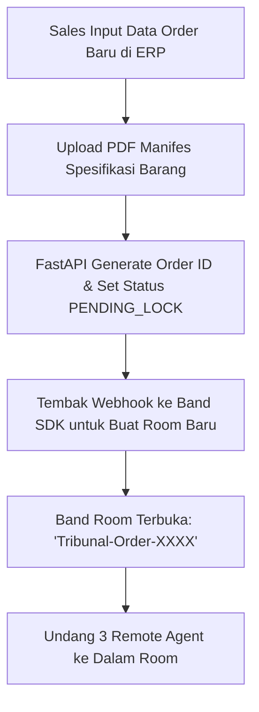

## 11.3 Flow Analisis Teknis & Klasifikasi ECCN (Agent 1)

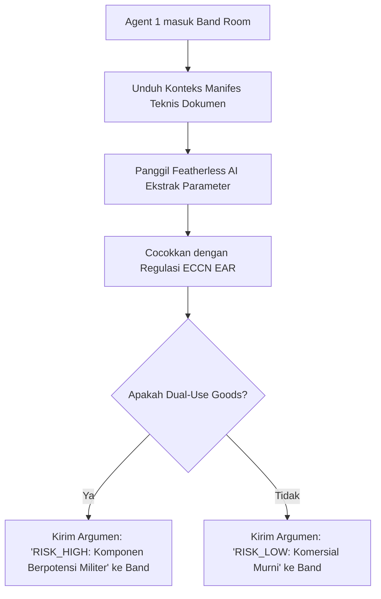

## 11.4 Flow Investigasi Sanksi & Shell Company (Agent 2)

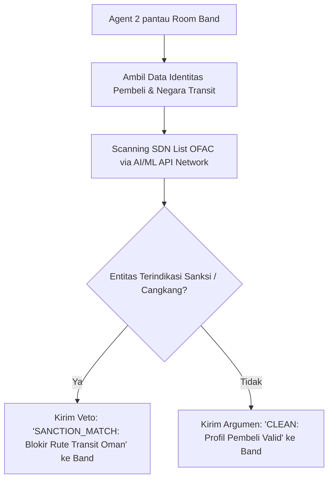

## 11.5 Flow Sidang Arbitrase & Pengambilan Keputusan (Agent 3)

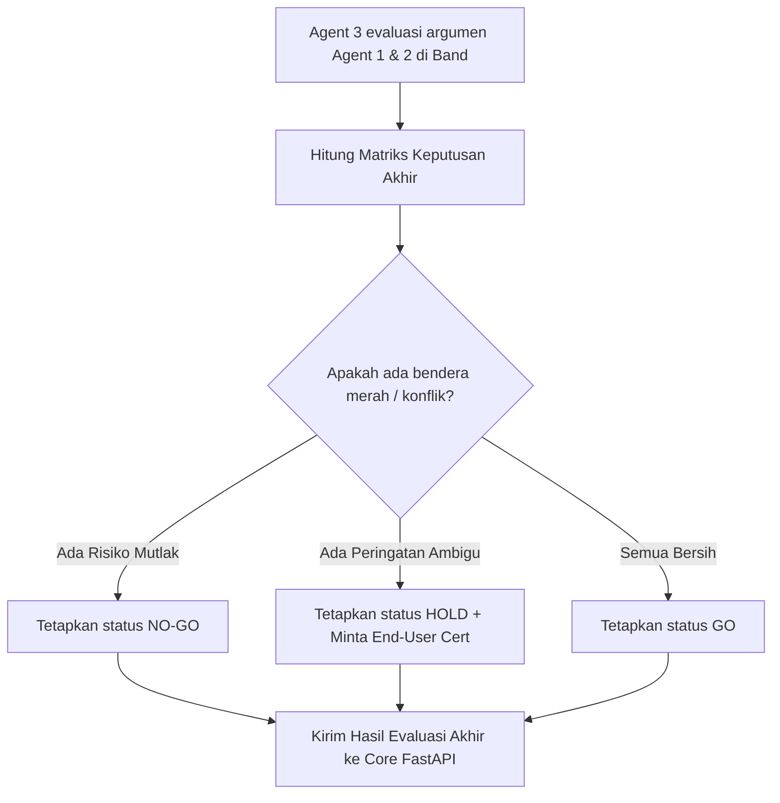

## 11.6 Flow Verifikasi Tambahan Dokumen (Human-in-the-Loop)

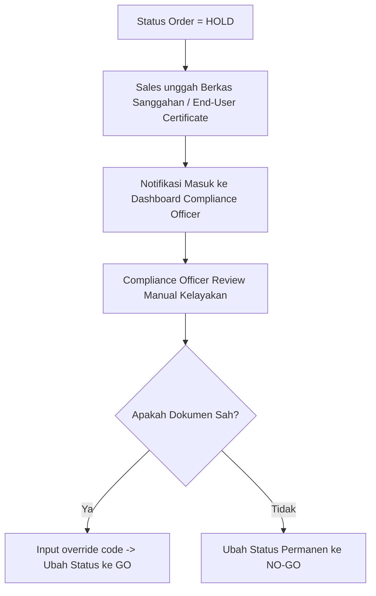

## 11.7 Flow Pemicuan Kunci Logistik Otomatis (Warehouse Locking)

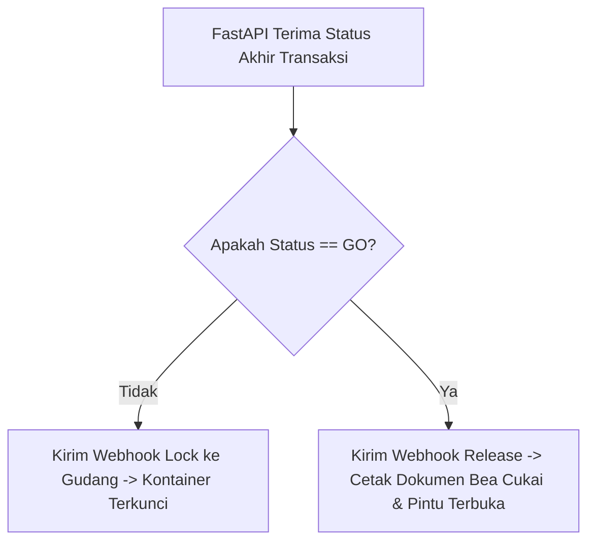

## 11.8 Flow Ekstraksi Audit Trail untuk Pemeriksaan Otoritas

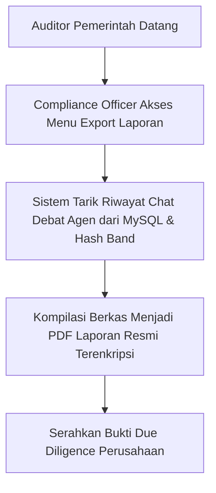

---

# 12. Use Case Diagram

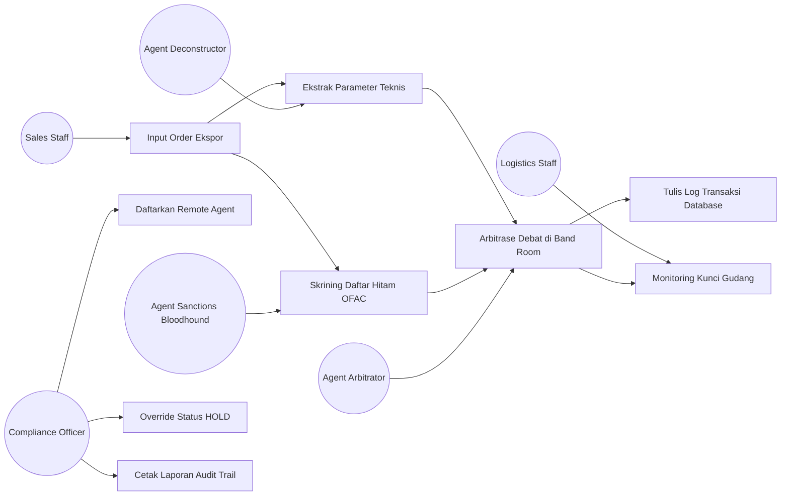

---

# 13. Daftar Use Case

| Kode | Use Case | Aktor | Prioritas |
| --- | --- | --- | --- |
| UC-01 | Registrasi Remote Agent | Compliance Officer | High |
| UC-02 | Input Order Ekspor Baru | Sales Staff | High |
| UC-03 | Ekstrak Parameter & ECCN | Agent 1 (Manifest Deconstructor) | High |
| UC-04 | Skrining Sanksi & Cangkang | Agent 2 (Sanctions Bloodhound) | High |
| UC-05 | Arbitrase & Veto Keputusan | Agent 3 (Logistics Legal-Arbitrator) | High |
| UC-06 | Override Status Penangguhan | Compliance Officer | Medium |
| UC-07 | Monitoring Kunci Gudang | Logistics Staff | High |
| UC-08 | Cetak Laporan Audit Trail | Compliance Officer | Medium |
| UC-09 | Sinkronisasi Log Database | Sistem Core FastAPI / MySQL | High |

---

# 14. Use Case Specification

## 14.1 UC-01 Registrasi Remote Agent

* **Aktor:** Compliance Officer (Admin)
* **Tujuan:** Menghubungkan script AI eksternal penggerak model ke framework Band.ai.
* **Precondition:** Dashboard Band.ai terbuka pada menu `Connect Remote Agent`.
* **Main Flow:** Input Agent Name, isi Deskripsi, set handle `@hilmimubarok2006/agent`, aktifkan opsi *Personal Registry Access*, simpan konfigurasi.
* **Postcondition:** Jembatan API Key terbit, status agen berubah menjadi *Active Remote*.

## 14.2 UC-02 Input Order Ekspor Baru

* **Aktor:** Sales Staff
* **Tujuan:** Mengirimkan data pengapalan barang baru ke sistem kontrol kepatuhan.
* **Input:** Nama Perusahaan Pembeli, Alamat, Negara Tujuan, Rute Transit, Dokumen Manifes Manufaktur (PDF).
* **Proses:** FastAPI menerima data, mengunci status gudang menjadi `PENDING_LOCK`, memicu pembuatan room Band.
* **Audit Log:** `ORDER_INGESTED_TRACKING_INITIATED`.

## 14.3 UC-05 Arbitrase Debat di Band Room

* **Aktor:** Agent 3 (Logistics Legal-Arbitrator)
* **Tujuan:** Membaca perdebatan Agen 1 & 2 di platform Band, mengambil keputusan konklusif.
* **Main Flow:** Agen 3 memantau teks chat room. Jika Agen 1 menyatakan risiko ECCN tinggi dan Agen 2 menyatakan rute bersih, Agen 3 memutuskan status `HOLD` karena ketidakpastian tinggi, menolak opsi `GO` demi keselamatan hukum korporasi.
* **Output:** Status ekspor dilempar ke FastAPI via REST API / Webhook.

---

# 15. Sequence Diagram

## 15.1 Sequence Proses Kepatuhan Ekspor Multi-Agent

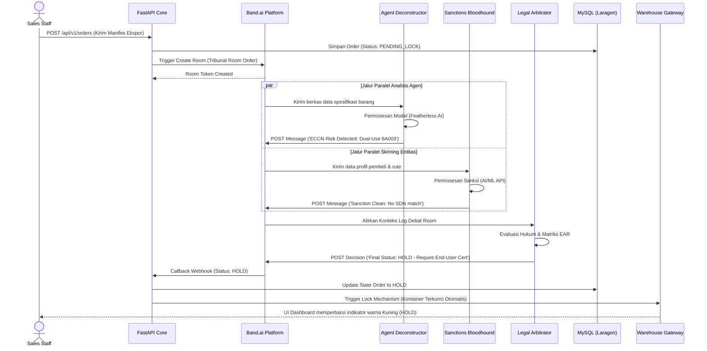

---

# 16. State Diagram

## 16.1 State Logika Keputusan Ekspor (Order Compliance Lifecycle)

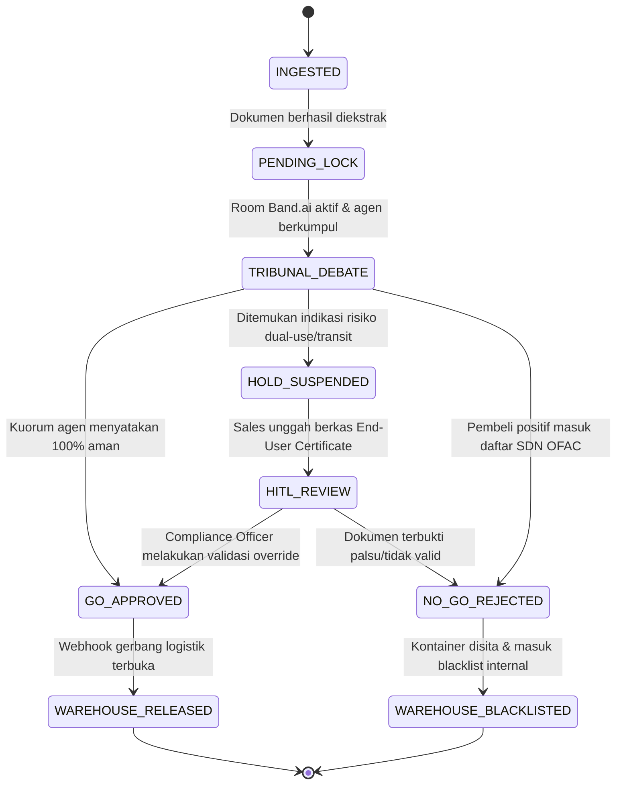

---

# 17. Entity Relationship Diagram

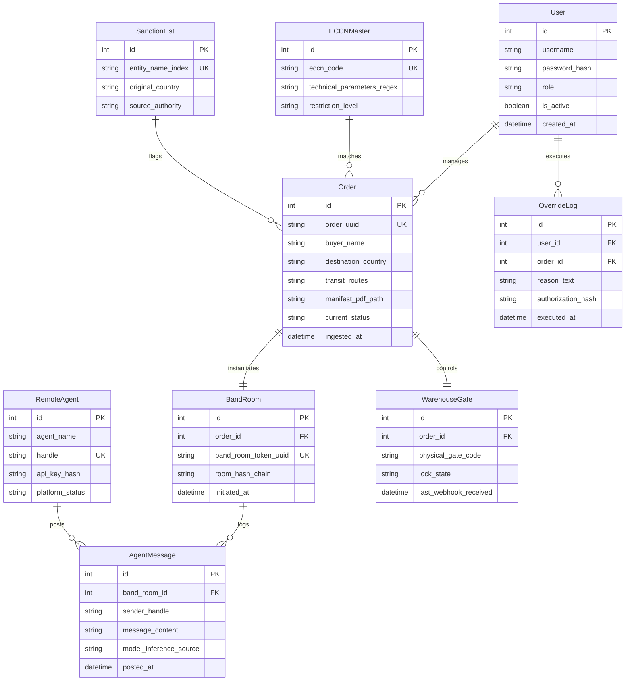

---

# 18. Database Design

## 18.1 Prinsip Database AegisTrade

1. Log debat antar agen dari platform Band disimpan secara kronologis menggunakan tipe data text panjang dan tidak boleh diubah oleh sistem (*read-only constraint*).
2. Nama entitas sanksi disimpan menggunakan indeks pencarian khusus untuk menghindari manipulasi karakter spasi/tanda baca oleh aktor pembeli nakal.
3. Struktur skema database dirancang modular menggunakan platform Laragon MySQL untuk menjamin integrasi transaksional yang cepat dengan framework FastAPI.

## 18.2 Python SQLAlchemy Schema Draft

```python
from sqlalchemy import Column, Integer, String, Boolean, DateTime, ForeignKey, Text
from sqlalchemy.orm import relationship
from sqlalchemy.ext.declarative import declarative_base
import datetime

Base = declarative_base()

class User(Base):
    __tablename__ = 'users'
    id = Column(Integer, primary_key=True, autoincrement=True)
    username = Column(String(50), unique=True, nullable=False)
    password_hash = Column(String(255), nullable=False)
    role = Column(String(30), nullable=False) # Compliance, Sales, Logistik
    is_active = Column(Boolean, default=True)
    created_at = Column(DateTime, default=datetime.datetime.utcnow)

class Order(Base):
    __tablename__ = 'orders'
    id = Column(Integer, primary_key=True, autoincrement=True)
    order_uuid = Column(String(64), unique=True, nullable=False)
    buyer_name = Column(String(150), nullable=False)
    destination_country = Column(String(100), nullable=False)
    transit_routes = Column(String(255), nullable=True)
    manifest_pdf_path = Column(String(255), nullable=False)
    current_status = Column(String(30), default='PENDING_LOCK') # GO, HOLD, NO-GO
    ingested_at = Column(DateTime, default=datetime.datetime.utcnow)

    room = relationship("BandRoom", uselist=False, back_populates="order")

class BandRoom(Base):
    __tablename__ = 'band_rooms'
    id = Column(Integer, primary_key=True, autoincrement=True)
    order_id = Column(Integer, ForeignKey('orders.id'), nullable=False)
    band_room_token_uuid = Column(String(64), unique=True, nullable=False)
    room_hash_chain = Column(String(128), nullable=False)
    initiated_at = Column(DateTime, default=datetime.datetime.utcnow)

    order = relationship("Order", back_populates="room")
    messages = relationship("AgentMessage", back_populates="room")

class AgentMessage(Base):
    __tablename__ = 'agent_messages'
    id = Column(Integer, primary_key=True, autoincrement=True)
    band_room_id = Column(Integer, ForeignKey('band_rooms.id'), nullable=False)
    sender_handle = Column(String(50), nullable=False) # e.g., @hilmimubarok2006/agent-deconstructor
    message_content = Column(Text, nullable=False)
    model_inference_source = Column(String(50), nullable=False) # Featherless_AI, AIML_API
    posted_at = Column(DateTime, default=datetime.datetime.utcnow)

    room = relationship("BandRoom", back_populates="messages")

```

---

# 19. Business Rules

## 19.1 Ingestion & ECCN Validation Rules

1. Dokumen manifes wajib menyertakan lembar parameter teknis spesifikasi unit.
2. Jika Agent 1 mendeteksi kata kunci sensitif berspesifikasi militer, status order wajib dikunci menjadi `HOLD` secara otomatis tanpa menunggu respon Agen 2.

## 19.2 Sanctions & Transit Rules

1. Setiap entitas pembeli yang memiliki kemiripan nama di atas 85% dengan entitas SDN OFAC wajib diklasifikasikan sebagai ancaman tinggi.
2. Semua pengapalan yang melewati atau singgah di negara kategori *High-Risk Transit Hub* wajib melalui skema peninjauan *Triple-Agent Verification Loop*.

## 19.3 Multi-Agent Tribunal Rules

1. Keputusan bertanda **GO** wajib disetujui secara mutlak oleh minimal 2 agen operasional (Agent 1 & Agent 2) dan disahkan secara final oleh Agent 3.
2. Jika terjadi perdebatan buntu (*deadlock*) antara Agent 1 (Risiko Teknis) dan Agent 2 (Risiko Sanksi), Agent 3 wajib mengambil opsi paling aman bagi perusahaan, yaitu menerbitkan keputusan **HOLD**.

## 19.4 Logistics Automation Rules

1. Kontainer fisik tidak boleh dipindahkan dari zona karantina gudang jika sistem kontrol menerima kode status `HOLD` atau `NO-GO`.
2. Override manual terhadap status hukum sistem hanya bisa dilakukan oleh Compliance Officer dengan menyertakan tanda tangan digital otoritas (*hash code certificate*).

---

# 20. Functional Requirements

## 20.1 Core API & Ingestion Endpoint

| ID | Requirement | Priority |
| --- | --- | --- |
| FR-API-01 | Sistem menyediakan API endpoint aman menerima JSON order ekspor | High |
| FR-API-02 | Sistem mengintegrasikan skema ekstraksi PDF teks otomatis | High |
| FR-API-03 | Sistem memicu pembuatan room otonom via Band SDK | High |

## 20.2 Agent Management & Framework Interaction

| ID | Requirement | Priority |
| --- | --- | --- |
| FR-AGT-01 | Sistem memetakan handle pendaftaran `@hilmimubarok2006/agent` | High |
| FR-AGT-02 | Agen AI mampu melakukan streaming input ke chat room Band | High |
| FR-AGT-03 | Agent 3 mampu membaca riwayat chat room secara sekuensial | High |

## 20.3 Compliance & Oversight Operations

| ID | Requirement | Priority |
| --- | --- | --- |
| FR-COMP-01 | Sistem menyediakan tombol override manual status HOLD | Medium |
| FR-COMP-02 | Sistem mengekspor berkas PDF log audit terenkripsi | High |
| FR-COMP-03 | Sistem menolak penghapusan baris data log debat | High |

---

# 21. Non-Functional Requirements

| ID | Requirement | Target |
| --- | --- | --- |
| NFR-01 | Waktu Proses Arbitrase Agen | Maksimal 30 detik semenjak order masuk |
| NFR-02 | Keamanan Enkripsi Log | SHA-256 Room Hash Chain |
| NFR-03 | Availabilitas API Inference | Integrasi ganda Featherless + AI/ML API |
| NFR-04 | Lingkungan Database Lokal | MySQL v8.0 via Laragon Environment |
| NFR-05 | Keamanan Akses Token | JWT Token Expired dalam 15 menit |
| NFR-06 | Toleransi Kegagalan Jaringan | Sistem menyimpan log offline jika Band.ai mengalami interupsi |

---

# 22. API Contract

## 22.1 Transational Trade API Gateway

| Method | Endpoint | Role | Deskripsi |
| --- | --- | --- | --- |
| POST | `/api/v1/compliance/orders` | Sales Staff | Ingestion order ekspor baru |
| GET | `/api/v1/compliance/orders/:id` | All Internal Roles | Ambil status kelayakan order |
| POST | `/api/v1/agents/connect-remote` | Compliance Officer | Daftarkan remote agent baru |
| GET | `/api/v1/band/rooms/:room_id/logs` | Compliance Officer | Ambil salinan chat debat di Band |
| POST | `/api/v1/compliance/override` | Compliance Officer | Lakukan override status HOLD |
| POST | `/api/v1/warehouse/webhook-lock` | Agent Arbitrator | Tembak status kunci gerbang gudang |

---

# 23. UI/UX Requirement

## 23.1 Prinsip Desain Antarmuka

1. Desain bersih, kaku, dan berstandar korporat industri tinggi.
2. Indikator status kelayakan (GO, HOLD, NO-GO) menggunakan sistem penandaan warna dengan kontras tajam.
3. Tampilan log ruang sidang digital divisualisasikan mirip dengan interface percakapan multi-kolom yang scannable.

## 23.2 Token Warna (Tribunal Professional System Palette)

| Nama Warna | Hex Code | Penggunaan Utama |
| --- | --- | --- |
| Deep Aegis Blue | `#0F172A` | Sidebar navigasi, header utama |
| Tribunal Amber | `#D97706` | Indikator penangguhan status HOLD |
| Enforcement Red | `#DC2626` | Pelanggaran sanksi status NO-GO |
| Clearance Green | `#16A34A` | Order lolos status GO |
| Charcoal Text | `#334155` | Teks deskripsi dokumen & log chat |
| Laragon White | `#F8FAFC` | Latar belakang dashboard utama |

---

# 24. Data Validation

1. **Validasi Nomor ECCN:** Format input kode wajib tervalidasi terhadap regex standar Biro Industri dan Keamanan (BIS) AS (misal: lima karakter alfa-numerik seperti `3A001` atau `6A003`).
2. **Validasi File Manifes:** Sistem menolak jenis file di luar format `.pdf` terenkripsi teks murni. Scan gambar mentah wajib ditolak jika tidak melewati modul OCR lokal.
3. **Validasi Sanggahan Dokumen:** File override *End-User Certificate* wajib memiliki nomor paspor pembeli akhir yang tervalidasi 100% numerik bersih.

---

# 25. Error Handling

| Kondisi Masalah | Mekanisme Respon Sistem |
| --- | --- |
| API Inference Sponsor Mati | FastAPI otomatis memindahkan beban token dari Featherless ke AI/ML API |
| Struktur Manifes PDF Rusak | Order otomatis diberi status HOLD, sistem meminta Sales re-upload berkas |
| Percobaan Edit Database Manual | Deteksi integritas hash gagal, dashboard memblokir fungsi rilis gerbang |
| Akses Token Band.ai Expired | Sistem melakukan jabat tangan ulang (*re-handshake*) otomatis di latar belakang |

---

# 26. Threat Model & Mitigasi

| Ancaman Kemanan (Threat) | Dampak Risiko | Metode Mitigasi Sistem |
| --- | --- | --- |
| Injeksi Agen AI Palsu di Jaringan | Manipulasi sidang hukum | Autentikasi ketat API key di menu Registry Access |
| Modifikasi Deskripsi Manifes Teknis | Penyelundupan komponen | Agent 1 mengekstrak nomor seri fisik ke pabrik |
| Pemalsuan Surat End-User Cert | Lolosnya sanksi sekunder | Skema HITL mewajibkan verifikasi tanda tangan digital |
| Kegagalan Server Wi-Fi Gudang | Pintu logistik terbuka | Mekanisme kunci fisik bertipe *Fail-Secure* (Terkunci) |

---

# 27. Struktur Folder Proyek

```text
aegistrade-ai/
├── backend-fastapi/
│   ├── app/
│   │   ├── main.py
│   │   ├── config.py
│   │   ├── controllers/
│   │   │   ├── compliance_controller.py
│   │   │   └── agent_register_controller.py
│   │   ├── middleware/
│   │   │   └── token_validator.py
│   │   ├── models/
│   │   │   └── db_models.py
│   │   ├── services/
│   │   │   ├── band_sdk_service.py
│   │   │   ├── featherless_inference.py
│   │   │   └── aiml_api_fallback.py
│   │   └── webhooks/
│   │       └── warehouse_trigger.py
│   ├── requirements.txt
│   └── konfig.txt
├── frontend-react/
│   ├── src/
│   │   ├── main.jsx
│   │   ├── App.jsx
│   │   ├── components/
│   │   │   ├── TribunalRoomViewer.jsx
│   │   │   └── WarehouseLockStatus.jsx
│   │   └── pages/
│   │       ├── DashboardCompliance.jsx
│   │       └── ConnectRemoteAgentPage.jsx
└── Database/
    └── aegistrade_db.sql

```

---

# 28. Testing Plan

1. **Functional Test Loop:** Memasukkan pesanan simulasi dengan pembeli bernama "Russian Aerospace Agency Transit Route Istanbul". Target output: Agent 2 wajib menembakkan status `NO-GO` dalam 10 detik.
2. **Security Stress Test:** Melakukan interupsi paksa pada koneksi internet saat Agent 1 sedang menulis argumen di Band.ai. Target: Sistem mendeteksi *broken state* dan langsung memicu status `HOLD` di database Laragon.

---

# 29. Acceptance Criteria

Sistem AegisTrade AI dinyatakan memenuhi kriteria MVP jika:

1. Hub pendaftaran Remote Agent (`Connect Remote Agent Dashboard`) berfungsi normal menerima handle `@hilmimubarok2006/agent`.
2. Minimal 3 Agen AI dapat berinteraksi di dalam satu ekosistem room Band SDK.
3. Hasil keluaran status (GO/HOLD/NO-GO) terkirim secara akurat ke database lokal MySQL di Laragon.
4. Perubahan status dari AI terbukti memicu simulasi penguncian/pelepas kunci gerbang logistik gudang.

---

# 30. Roadmap Implementasi

* **Fase 1 — Fondasi & Arsitektur Jaringan Agen (Hari 1-2):** Konfigurasi awal FastAPI, setup database di Laragon, integrasi modul dasar Band SDK, pendaftaran remote agent handle.
* **Fase 2 — Kecerdasan Agen & Rekayasa Prompt (Hari 3-4):** Integrasi API Key Featherless AI dan AI/ML API, pembuatan system prompt bertolak belakang untuk Agen 1, 2, dan 3.
* **Fase 3 — Integrasi Logistik & Pemolesan Antarmuka (Hari 5-6):** Pembuatan dashboard React, simulasi trigger webhook penguncian gudang, penyusunan berkas laporan ekspor.

---

# 31. Demo Scenario untuk Lomba

1. **Skenario 1: Deteksi Dual-Use Komponen Sensitif:** Sales mencoba memasukkan order ekspor sensor AC. Agent 1 mendeteksi sensor tersebut berspesifikasi militer. Sistem langsung berubah menjadi warna kuning (HOLD).
2. **Skenario 2: Pendeteksian Jalur Transit Ilegal:** Memasukkan order dengan pembeli entitas baru di Oman. Agent 2 melacak histori kepemilikan modal dan mendeteksi korelasi dengan perusahaan sanksi internasional. Hasil akhir: Pintu gudang terkunci otomatis (NO-GO).

---

# 32. Risiko dan Mitigasi

* **Risiko Kasus:** Biaya token API membengkak akibat perdebatan antar agen AI yang berputar-putar tanpa henti (*infinite looping debate*).
* **Mitigasi Kasus:** Di dalam backend FastAPI Band SDK Service, sistem dipasang aturan pembatasan maksimal pertukaran argumen sebanyak **3 putaran chat**. Jika putaran ke-3 selesai tanpa kuorum, Agent 3 wajib memutus sepihak dengan keputusan teraman: **HOLD**.

---

# 33. Glossary

* **EAR (Export Administration Regulations):** Aturan hukum federal AS yang mengendalikan ekspor barang komersial sipil yang berpotensi disalahgunakan untuk militer.
* **Dual-Use Technology:** Barang, teknologi, atau perangkat lunak yang dirancang untuk kebutuhan komersial namun dapat dimodifikasi menjadi komponen taktis persenjataan.
* **ECCN (Export Control Classification Number):** Kode klasifikasi lima digit alfa-numerik yang digunakan dalam EAR untuk mengidentifikasi barang yang terkena kontrol ekspor.
* **SDN List (Specially Designated Nationals):** Daftar individu dan korporasi yang dilarang total untuk diajak berbisnis karena terafiliasi dengan aksi terorisme, pelanggaran hukum siber, atau negara agresi.

---

# 34. Penutup

AegisTrade AI dirancang sebagai solusi pertahanan legalitas korporasi tingkat tinggi yang memanfaatkan kekuatan sejati dari arsitektur multi-agent otonom pada platform **Band SDK**. Dengan menggabungkan pemrosesan dokumen parameter teknis yang mendalam bersama penyaringan sanksi geopolitik yang dinamis, sistem ini mengubah proses birokrasi kepatuhan hukum perdagangan internasional yang lambat menjadi sistem sensor otonom yang instan, aman, transparan, dan akuntabel di level rantai pasok fisik perusahaan.

```

```
